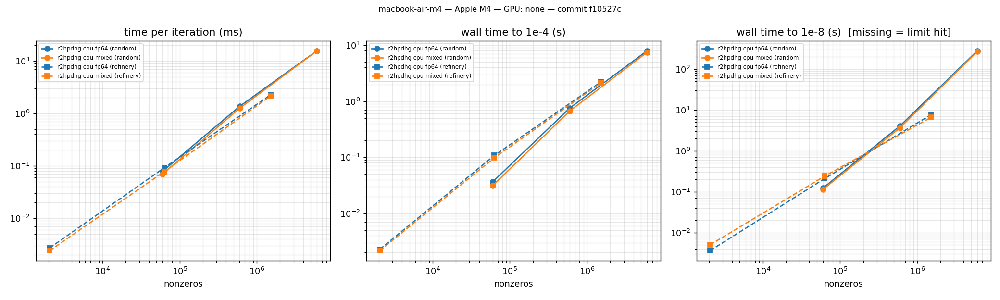

# Evidence pack

Generated by `bench/make_evidence.py` from **committed** CSVs in `bench/results/` only (CLAUDE.md §5.1). Every table names its source file; the git short hash is in each filename. Nothing here is a target or an estimate.

Files used:

- `bench/results/netlib-full-r2hpdhg-fp64-macbook-air-m4-5649634.csv` (committed 2026-09-25)
- `bench/results/netlib-full-r2hpdhg-fp64-macbook-air-m4-f10527c.csv` (committed 2026-09-25)
- `bench/results/netlib-small-3318a86.csv` (committed 2026-09-24)
- `bench/results/netlib-small-62a13f2.csv` (committed 2026-09-24)
- `bench/results/netlib-small-f10527c.csv` (committed 2026-09-25)
- `bench/results/scale-macbook-air-m4-62a13f2.csv` (committed 2026-09-24)
- `bench/results/scale-macbook-air-m4-f10527c.csv` (committed 2026-09-25)
- `bench/results/warm-start-macbook-air-m4-d699097.csv` (committed 2026-09-25)

## 1. Correctness on small Netlib (oracle, PDLP-style PDHG, r²HPDHG; fp64 and mixed)

Source: `bench/results/netlib-small-f10527c.csv` — machine `macbook-air-m4` (Apple M4), commit `f10527c`.

| instance | rows×cols | published optimum | oracle dd | pdlp fp64 | pdlp mixed | r2hpdhg fp64 | r2hpdhg mixed |
|---|---|---|---|---|---|---|---|
| afiro | 27×32 | -464.75314286 | -464.753142857 (PASS) | -464.753142843 (PASS, 704 it) | -464.753143149 (PASS, 576 it) | -464.753142932 (PASS, 512 it) | -464.753142916 (PASS, 512 it) |
| sc50a | 50×48 | -64.575077059 | -64.5750770586 (PASS) | -64.575077139 (PASS, 1664 it) | -64.5750772447 (PASS, 1856 it) | -64.5750775154 (PASS, 768 it) | -64.5750776003 (PASS, 832 it) |
| sc50b | 50×48 | -70 | -70 (PASS) | -69.9999991375 (PASS, 1984 it) | -69.9999990393 (PASS, 1664 it) | -69.9999990368 (PASS, 1792 it) | -70.0000004428 (PASS, 1856 it) |
| kb2 | 43×41 | -1749.9001299 | -1749.90012991 (PASS) | -1749.90012991 (PASS, 39872 it) | -1749.90012991 (PASS, 46272 it) | -1749.90012991 (PASS, 21568 it) | -1749.90012991 (PASS, 21568 it) |
| adlittle | 56×97 | 225494.96316 | 225494.963162 (PASS) | 225494.962221 (PASS, 15040 it) | 225494.964706 (PASS, 17280 it) | 225494.962992 (PASS, 5952 it) | 225494.965447 (PASS, 8576 it) |
| blend | 74×83 | -30.812149846 | -30.8121498458 (PASS) | -30.812150044 (PASS, 3392 it) | -30.8121495896 (PASS, 4160 it) | -30.8121501329 (PASS, 2112 it) | -30.8121500028 (PASS, 2688 it) |
| share2b | 96×79 | -415.73224074 | -415.732240741 (PASS) | -415.732245224 (PASS, 92736 it) | -415.732245431 (PASS, 108544 it) | -415.732235176 (PASS, 54720 it) | -415.732234659 (PASS, 67968 it) |
| sc105 | 105×103 | -52.202061212 | -52.2020612117 (PASS) | -52.2020604186 (PASS, 4608 it) | -52.2020606572 (PASS, 4992 it) | -52.2020611773 (PASS, 2304 it) | -52.2020607122 (PASS, 3456 it) |
| stocfor1 | 117×111 | -41131.976219 | -41131.9762194 (PASS) | -41131.9754798 (PASS, 15040 it) | -41131.9768173 (PASS, 14464 it) | -41131.9761397 (PASS, 6784 it) | -41131.9762089 (PASS, 7616 it) |
| recipe | 91×180 | -266.616 | -266.616 (PASS) | -266.616000023 (PASS, 2112 it) | -266.616000018 (PASS, 2176 it) | -266.615999982 (PASS, 896 it) | -266.616000033 (PASS, 1536 it) |

**50 of 50 runs verified PASS** by `tools/verify.py` (independent reader, primal/dual/gap ≤ 1e-6 relative) and within 1e-6 of the published optimum. First-order runs target relative KKT 1e-8.

Iterations to 1e-8 (fp64): r²HPDHG needs fewer than PDLP-style PDHG on 10 of 10 instances; total 97408 vs 177152 iterations.

## 1b. Full Netlib LP set (first-order engine)

Source: `bench/results/netlib-full-r2hpdhg-fp64-macbook-air-m4-f10527c.csv` — r2hpdhg fp64 on cpu (`macbook-air-m4`, Apple M4), commit `f10527c`, time limit 60.0 s per model.

- **81 of 93** Netlib LPs solved to relative KKT 1e-8 and verified PASS by `tools/verify.py`; **81** of those agree with HiGHS to 1e-6 relative.
- 12 hit the time/iteration limit (listed below, not hidden); 0 other outcomes.

| model | rows | cols | nnz | status | iterations | rel. err vs HiGHS at stop |
|---|---|---|---|---|---|---|
| bnl2 | 2324 | 3489 | 13999 | TimeLimit | 3334528 | 1.71e-08 |
| d2q06c | 2171 | 5167 | 32417 | TimeLimit | 1728960 | 2.55e-10 |
| fit1d | 24 | 1026 | 13404 | TimeLimit | 3664384 | 5.26e-08 |
| fit2d | 25 | 10500 | 129018 | TimeLimit | 336640 | 1.94e-04 |
| greenbea | 2392 | 5405 | 30877 | TimeLimit | 1786816 | 9.36e-01 |
| nesm | 662 | 2923 | 13288 | TimeLimit | 4699072 | 1.01e-07 |
| perold | 625 | 1376 | 6018 | TimeLimit | 9027008 | 7.60e-07 |
| pilot.ja | 940 | 1988 | 14698 | TimeLimit | 3798592 | 1.31e-05 |
| pilot | 1441 | 3652 | 43167 | TimeLimit | 1364416 | 3.13e-05 |
| pilot.we | 722 | 2789 | 9126 | TimeLimit | 5548864 | 1.03e-04 |
| pilot4 | 410 | 1000 | 5141 | TimeLimit | 11225536 | 1.55e-06 |
| pilot87 | 2030 | 4883 | 73152 | TimeLimit | 775360 | 7.12e-07 |

## 2. Scaling on generated LPs with known optimum (CPU)

Source: `bench/results/scale-macbook-air-m4-f10527c.csv` — machine `macbook-air-m4` (Apple M4; GPU: none), commit `f10527c`.

| instance | rows | nnz | engine | backend | prec | status | iterations | s to 1e-4 | s to 1e-8 | ms/iter | rel. err vs known opt | verify |
|---|---|---|---|---|---|---|---|---|---|---|---|---|
| rand-10000-s1 | 10000 | 60024 | r2hpdhg | cpu | fp64 | Optimal | 1472 | 0.0365 | 0.123 | 0.0784 | 8.62e-10 | PASS |
| rand-10000-s1 | 10000 | 60024 | r2hpdhg | cpu | mixed | Optimal | 1536 | 0.0313 | 0.114 | 0.0696 | 1.11e-10 | PASS |
| rand-100000-s1 | 100000 | 600228 | r2hpdhg | cpu | fp64 | Optimal | 2944 | 0.759 | 4.1 | 1.37 | 2.15e-10 | PASS |
| rand-100000-s1 | 100000 | 600228 | r2hpdhg | cpu | mixed | Optimal | 2880 | 0.673 | 3.7 | 1.26 | 6.45e-10 | PASS |
| rand-1000000-s1 | 1000000 | 6002453 | r2hpdhg | cpu | fp64 | Optimal | 17856 | 7.94 | 282 | 15.7 | 1.41e-11 | skipped |
| rand-1000000-s1 | 1000000 | 6002453 | r2hpdhg | cpu | mixed | Optimal | 17152 | 7.47 | 269 | 15.6 | 1.59e-11 | skipped |
| refinery-T12-s1 | 588 | 2065 | r2hpdhg | cpu | fp64 | Optimal | 960 | 0.00228 | 0.0036 | 0.0027 | 1.71e-10 | PASS |
| refinery-T12-s1 | 588 | 2065 | r2hpdhg | cpu | mixed | Optimal | 1664 | 0.00215 | 0.005 | 0.0024 | 6.15e-10 | PASS |
| refinery-T365-s1 | 17885 | 63134 | r2hpdhg | cpu | fp64 | Optimal | 1728 | 0.108 | 0.21 | 0.0917 | 1.68e-12 | PASS |
| refinery-T365-s1 | 17885 | 63134 | r2hpdhg | cpu | mixed | Optimal | 2432 | 0.0983 | 0.24 | 0.0775 | 4.92e-11 | PASS |
| refinery-T8760-s1 | 429240 | 1515469 | r2hpdhg | cpu | fp64 | Optimal | 3008 | 2.21 | 7.68 | 2.28 | 1.60e-13 | PASS |
| refinery-T8760-s1 | 429240 | 1515469 | r2hpdhg | cpu | mixed | Optimal | 2688 | 2.13 | 6.64 | 2.16 | 6.10e-13 | PASS |

### 2b. Reference: HiGHS on the same instances

Source: `bench/results/scale-macbook-air-m4-62a13f2.csv` (same run, same machine). HiGHS default algorithm, separate process, hard-killed at the cap. HiGHS returns a vertex solution at simplex accuracy; our column is time to relative KKT 1e-8 with verifier-grade feasibility — not the identical accuracy target.

| instance | rows | nnz | r²HPDHG fp64 s→1e-8 | HiGHS s |
|---|---|---|---|---|
| rand-10000-s1 | 10000 | 60024 | 0.192 | 46.4 |
| rand-100000-s1 | 100000 | 600228 | 6.78 | > 600 (TimeLimit) |
| rand-1000000-s1 | 1000000 | 6002453 | 294 | > 600 (TimeLimit) |
| refinery-T12-s1 | 588 | 2065 | 0.0041 | 0.0073 |
| refinery-T365-s1 | 17885 | 63134 | 0.2 | 3.38 |
| refinery-T8760-s1 | 429240 | 1515469 | 7.38 | > 630 (TimeLimit) |

## 3. CPU vs GPU

**Not measured yet.** The CUDA backend (`src/gpu/cuda_backend.cu`) is written and type-checked on macOS, but no committed CSV comes from a GPU machine, so this pack makes **no GPU speed claim**. To produce one: `PS26119_MACHINE=<name> scripts/gpu_check.sh` on the NVIDIA laptop / university server, then commit `bench/results/` and rerun this script.

## 4. Refinery planning year

Hourly year, T = 8760 periods: 429240 rows, 516840 columns, 1515469 nonzeros (generated by `bench/generate_refinery_lp.py`; optimum known by construction).

| engine | backend | prec | status | iterations | s to 1e-4 | s to 1e-8 | rel. err vs known opt | verify | source |
|---|---|---|---|---|---|---|---|---|---|
| r2hpdhg | cpu | fp64 | Optimal | 2752 | 2.54 | 7.38 | 5.41e-13 | PASS | `scale-macbook-air-m4-62a13f2.csv` |
| r2hpdhg | cpu | mixed | Optimal | 2688 | 2.42 | 6.9 | 6.09e-13 | PASS | `scale-macbook-air-m4-62a13f2.csv` |
| highs | cpu | fp64 | TimeLimit | – | – | – | – | reference | `scale-macbook-air-m4-62a13f2.csv` |
| r2hpdhg | cpu | fp64 | Optimal | 3008 | 2.21 | 7.68 | 1.60e-13 | PASS | `scale-macbook-air-m4-f10527c.csv` |
| r2hpdhg | cpu | mixed | Optimal | 2688 | 2.13 | 6.64 | 6.10e-13 | PASS | `scale-macbook-air-m4-f10527c.csv` |

## 4b. Warm-started re-solves (what-if scenarios on the refinery LP)

Source: `bench/results/warm-start-macbook-air-m4-d699097.csv` — `macbook-air-m4` (Apple M4), commit `d699097`. Each scenario solved cold and warm-started from the base-case solution, both to 1e-8, both verified.

| instance | scenario | objective change | cold it | warm it | warm/cold | warm+ω it | warm+ω/cold | verify |
|---|---|---|---|---|---|---|---|---|
| refinery-T365-s1 | price | +3.180e-03 | 13504 | 13760 | 1.019 | 28544 | 2.114 | PASS/PASS/PASS |
| refinery-T365-s1 | demand | +3.068e-02 | 2240 | 1984 | 0.886 | 1408 | 0.629 | PASS/PASS/PASS |
| refinery-T365-s1 | crude | -1.124e-02 | 1664 | 1408 | 0.846 | 1408 | 0.846 | PASS/PASS/PASS |
| refinery-T8760-s1 | price | +3.596e-03 | 73536 | 55232 | 0.751 | 34688 | 0.472 | PASS/PASS/PASS |
| refinery-T8760-s1 | demand | +2.946e-02 | 2944 | 2048 | 0.696 | 1856 | 0.630 | PASS/PASS/PASS |
| refinery-T8760-s1 | crude | -9.681e-03 | 2880 | 1792 | 0.622 | 1408 | 0.489 | PASS/PASS/PASS |

warm = start from the base solution's (x, y) (default); warm+ω = also reuse its primal weight (opt-in `--warm-weight`). Iteration counts are deterministic; wall times are in the CSV.

## 5. What we do NOT do yet (honest list)

- **No GPU number is claimed** unless a GPU CSV appears in §3. The CUDA backend has not yet been compiled by nvcc or run at the time this list was written.
- **No MPS reader of our own in this build** — it is owned by a teammate; until it lands, MPS files are converted with `tools/mps_to_lpm.py` (highspy, tooling only, never linked).
- **No sparse simplex, no crossover, no presolve** yet: first-order solutions are accurate to the stated tolerance but are not vertices; exact duals/ranging need the (planned) crossover.
- **Infeasibility / unboundedness detection in the first-order engines is new and only lightly tested** (ray certificates, checked in fp64 on the original problem; unit-tested on hand-made infeasible/unbounded LPs, not yet on the Netlib infeasible set).
- **No MILP, no QP** yet (branch-and-bound and PDHG-QP are post-PPT milestones).
- **Generated instances**: the refinery LP has refinery structure, but its prices and inequality right-hand sides come from the KKT construction (synthetic), not from plant data; random LPs of this kind are friendly to first-order methods. Netlib / Mittelmann large models are the next evidence step.
- **Batched scenarios and certified dual bounds** (CLAUDE.md §9 items 4–5) are not implemented; warm start (item 3) exists for the first-order engines (see §4b) but not yet in the C API.
- Laptop timings vary run to run (a fanless MacBook Air throttles and macOS moves threads between performance and efficiency cores): the same 1e6-row run has taken 294 s and 539 s for identical iteration counts. Iteration counts are deterministic; compare those first.
- CPU runs are single-threaded (deterministic by default; OpenMP is optional and off).
