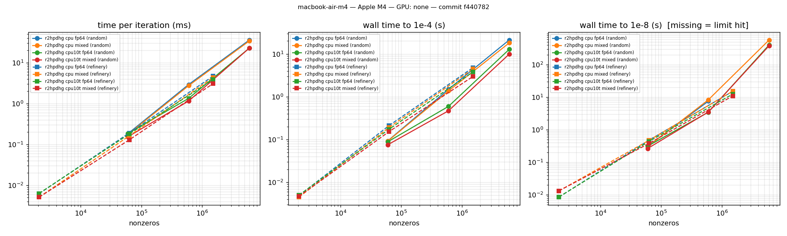
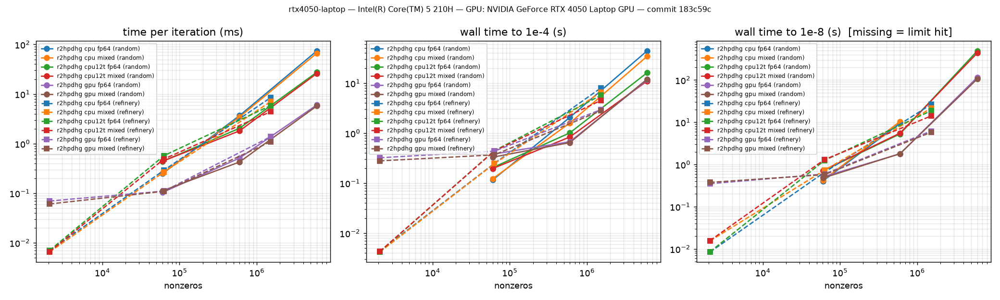

# Evidence pack

Generated by `bench/make_evidence.py` from **committed** CSVs in `bench/results/` only (CLAUDE.md §5.1). Every table names its source file; the git short hash is in each filename. Nothing here is a target or an estimate.

## Headline numbers

For slides: each number is recomputed from the newest committed CSV of its kind, with the rules of the sections below; the source file (git hash in its name) is in the last column.

| claim | result | source |
|---|---|---|
| Small Netlib, every engine x fp64/mixed, independent verifier | 60/60 verified | `netlib-small-183c59c.csv` |
| Netlib LP (all 93), `auto`, 60 s each: solved, verified, = HiGHS to 1e-6 | **93/93** | `netlib-full-auto-fp64-macbook-air-m4-f440782.csv` |
| Netlib LP (all 93), `simplex`, 60 s each: solved, verified, = HiGHS to 1e-6 | **92/93** | `netlib-full-simplex-fp64-macbook-air-m4-f440782.csv` |
| Netlib LP (all 93), `r2hpdhg`, 60 s each: solved, verified, = HiGHS to 1e-6 | **83/93** | `netlib-full-r2hpdhg-fp64-macbook-air-m4-f440782.csv` |
| Infeasible LPs (Netlib + objective cut), `simplex`: certified by gate AND verifier | **91/93** (72 in exact rational arithmetic) | `infeasible-cut-simplex-macbook-air-m4-f440782.csv` |
| Infeasible LPs (Netlib + objective cut), `r2hpdhg`: certified by gate AND verifier | **70/93** (55 in exact rational arithmetic) | `infeasible-cut-r2hpdhg-macbook-air-m4-f440782.csv` |
| Small MIPLIB 3, branch-and-bound, 300 s: proven optimal, verified | **12/14** | `miplib3-macbook-air-m4-f440782.csv` |
| `refinery-T8760-s1` (429240 rows, 1515469 nnz), r²HPDHG to 1e-8, CPU (Apple M4) | 1 thread 15.2 s (fp64); best 11 s (10 thr, mixed); error vs known optimum 1.20e-13, verify PASS | `scale-macbook-air-m4-f440782.csv` |
| `rand-1000000-s1` (1000000 rows, 6002453 nnz), r²HPDHG to 1e-8, CPU (Apple M4) | 1 thread 570 s (mixed); best 380 s (10 thr, mixed); error vs known optimum 1.23e-11, verify skipped | `scale-macbook-air-m4-f440782.csv` |
| GPU `NVIDIA GeForce RTX 4050 Laptop GPU`, refinery year, fp64 | 3.03× vs the fastest CPU configuration | `scale-rtx4050-laptop-183c59c.csv` |
| GPU `NVIDIA GeForce RTX 4050 Laptop GPU`, refinery year, mixed | 2.43× vs the fastest CPU configuration | `scale-rtx4050-laptop-183c59c.csv` |

Files used:

- `bench/results/batch-T8760-macbook-air-m4-8fd5170.csv` (committed 2026-09-25)
- `bench/results/batch-T8760-macbook-air-m4-ea97521.csv` (committed 2026-09-25)
- `bench/results/batch-macbook-air-m4-8fd5170.csv` (committed 2026-09-25)
- `bench/results/batch-macbook-air-m4-ea97521.csv` (committed 2026-09-25)
- `bench/results/batch-macbook-air-m4-f440782.csv` (committed 2026-09-27)
- `bench/results/compare-highs-Darwin-arm64-90fc378.csv` (committed 2026-09-28)
- `bench/results/compare-highs-ortools-macbook-air-m4-ad28954.csv` (committed 2026-09-28)
- `bench/results/infeasible-cut-r2hpdhg-macbook-air-m4-279fad6.csv` (committed 2026-09-27)
- `bench/results/infeasible-cut-r2hpdhg-macbook-air-m4-b04f2d8.csv` (committed 2026-09-27)
- `bench/results/infeasible-cut-r2hpdhg-macbook-air-m4-c935a78.csv` (committed 2026-09-27)
- `bench/results/infeasible-cut-r2hpdhg-macbook-air-m4-f440782.csv` (committed 2026-09-27)
- `bench/results/infeasible-cut-simplex-macbook-air-m4-279fad6.csv` (committed 2026-09-27)
- `bench/results/infeasible-cut-simplex-macbook-air-m4-b04f2d8.csv` (committed 2026-09-27)
- `bench/results/infeasible-cut-simplex-macbook-air-m4-c935a78.csv` (committed 2026-09-27)
- `bench/results/infeasible-cut-simplex-macbook-air-m4-f440782.csv` (committed 2026-09-27)
- `bench/results/miplib3-macbook-air-m4-0935157.csv` (committed 2026-09-25)
- `bench/results/miplib3-macbook-air-m4-b04f2d8.csv` (committed 2026-09-27)
- `bench/results/miplib3-macbook-air-m4-d824f82.csv` (committed 2026-09-26)
- `bench/results/miplib3-macbook-air-m4-eb90bbf.csv` (committed 2026-09-26)
- `bench/results/miplib3-macbook-air-m4-f440782.csv` (committed 2026-09-27)
- `bench/results/netlib-full-auto-fp64-macbook-air-m4-d824f82.csv` (committed 2026-09-26)
- `bench/results/netlib-full-auto-fp64-macbook-air-m4-eb90bbf.csv` (committed 2026-09-26)
- `bench/results/netlib-full-auto-fp64-macbook-air-m4-f440782.csv` (committed 2026-09-27)
- `bench/results/netlib-full-auto-fp64-macbook-air-m4-fc3f29c.csv` (committed 2026-09-26)
- `bench/results/netlib-full-r2hpdhg-fp64-gm12-macbook-air-m4-4f0db8c.csv` (committed 2026-09-25)
- `bench/results/netlib-full-r2hpdhg-fp64-gm4-macbook-air-m4-4f0db8c-dirty.csv` (committed 2026-09-25)
- `bench/results/netlib-full-r2hpdhg-fp64-macbook-air-m4-01f2eec.csv` (committed 2026-09-25)
- `bench/results/netlib-full-r2hpdhg-fp64-macbook-air-m4-4f0fc82.csv` (committed 2026-09-25)
- `bench/results/netlib-full-r2hpdhg-fp64-macbook-air-m4-5649634.csv` (committed 2026-09-25)
- `bench/results/netlib-full-r2hpdhg-fp64-macbook-air-m4-83736ba.csv` (committed 2026-09-25)
- `bench/results/netlib-full-r2hpdhg-fp64-macbook-air-m4-8fd5170.csv` (committed 2026-09-25)
- `bench/results/netlib-full-r2hpdhg-fp64-macbook-air-m4-d824f82.csv` (committed 2026-09-26)
- `bench/results/netlib-full-r2hpdhg-fp64-macbook-air-m4-f10527c.csv` (committed 2026-09-25)
- `bench/results/netlib-full-r2hpdhg-fp64-macbook-air-m4-f440782.csv` (committed 2026-09-27)
- `bench/results/netlib-full-r2hpdhg-fp64-presolve-macbook-air-m4-01f2eec.csv` (committed 2026-09-25)
- `bench/results/netlib-full-r2hpdhg-fp64-presolve-macbook-air-m4-83736ba.csv` (committed 2026-09-25)
- `bench/results/netlib-full-simplex-fp64-dantzig-macbook-air-m4-fc3f29c.csv` (committed 2026-09-26)
- `bench/results/netlib-full-simplex-fp64-macbook-air-m4-d824f82.csv` (committed 2026-09-26)
- `bench/results/netlib-full-simplex-fp64-macbook-air-m4-eb90bbf.csv` (committed 2026-09-26)
- `bench/results/netlib-full-simplex-fp64-macbook-air-m4-f440782.csv` (committed 2026-09-27)
- `bench/results/netlib-full-simplex-fp64-macbook-air-m4-fc3f29c.csv` (committed 2026-09-26)
- `bench/results/netlib-full-simplex-fp64-noscale-macbook-air-m4-fc3f29c.csv` (committed 2026-09-26)
- `bench/results/netlib-small-183c59c.csv` (committed 2026-09-27)
- `bench/results/netlib-small-3318a86.csv` (committed 2026-09-24)
- `bench/results/netlib-small-4f0fc82.csv` (committed 2026-09-25)
- `bench/results/netlib-small-62a13f2.csv` (committed 2026-09-24)
- `bench/results/netlib-small-82d376c.csv` (committed 2026-09-27)
- `bench/results/netlib-small-8fd5170.csv` (committed 2026-09-25)
- `bench/results/netlib-small-d824f82.csv` (committed 2026-09-26)
- `bench/results/netlib-small-eb90bbf.csv` (committed 2026-09-26)
- `bench/results/netlib-small-f10527c.csv` (committed 2026-09-25)
- `bench/results/netlib-small-f440782.csv` (committed 2026-09-27)
- `bench/results/netlib-small-fc3f29c.csv` (committed 2026-09-26)
- `bench/results/netlib-small-gpu-183c59c.csv` (committed 2026-09-27)
- `bench/results/netlib-small-gpu-82d376c.csv` (committed 2026-09-27)
- `bench/results/scale-macbook-air-m4-62a13f2.csv` (committed 2026-09-24)
- `bench/results/scale-macbook-air-m4-8fd5170.csv` (committed 2026-09-25)
- `bench/results/scale-macbook-air-m4-d824f82.csv` (committed 2026-09-26)
- `bench/results/scale-macbook-air-m4-ea97521.csv` (committed 2026-09-25)
- `bench/results/scale-macbook-air-m4-f10527c.csv` (committed 2026-09-25)
- `bench/results/scale-macbook-air-m4-f440782.csv` (committed 2026-09-27)
- `bench/results/scale-rtx4050-laptop-183c59c.csv` (committed 2026-09-27)
- `bench/results/scale-rtx4050-laptop-82d376c.csv` (committed 2026-09-27)
- `bench/results/scale-simplex-macbook-air-m4-d824f82.csv` (committed 2026-09-26)
- `bench/results/warm-start-macbook-air-m4-8fd5170.csv` (committed 2026-09-25)
- `bench/results/warm-start-macbook-air-m4-bd4e174.csv` (committed 2026-09-25)
- `bench/results/warm-start-macbook-air-m4-d699097.csv` (committed 2026-09-25)
- `bench/results/warm-start-macbook-air-m4-ea97521.csv` (committed 2026-09-25)
- `bench/results/warm-start-macbook-air-m4-f440782.csv` (committed 2026-09-27)

## 1. Correctness on small Netlib (oracle, PDLP-style PDHG, r²HPDHG; fp64 and mixed)

Source: `bench/results/netlib-small-183c59c.csv` — machine `rtx4050-laptop` (Intel(R) Core(TM) 5 210H), commit `183c59c`.

| instance | rows×cols | published optimum | oracle dd | simplex fp64 | pdlp fp64 | pdlp mixed | r2hpdhg fp64 | r2hpdhg mixed |
|---|---|---|---|---|---|---|---|---|
| afiro | 27×32 | -464.75314286 | -464.753142857 (PASS) | -464.753142857 (PASS, 23 it) | -464.753143836 (PASS, 512 it) | -464.753143661 (PASS, 512 it) | -464.753141878 (PASS, 448 it) | -464.753142022 (PASS, 448 it) |
| sc50a | 50×48 | -64.575077059 | -64.5750770586 (PASS) | -64.5750770586 (PASS, 45 it) | -64.575077139 (PASS, 1664 it) | -64.57507693 (PASS, 1536 it) | -64.5750775154 (PASS, 768 it) | -64.5750778726 (PASS, 832 it) |
| sc50b | 50×48 | -70 | -70 (PASS) | -70 (PASS, 48 it) | -69.9999991375 (PASS, 1984 it) | -70.0000008465 (PASS, 1728 it) | -69.9999990368 (PASS, 1792 it) | -69.9999996684 (PASS, 1600 it) |
| kb2 | 43×41 | -1749.9001299 | -1749.90012991 (PASS) | -1749.90012991 (PASS, 47 it) | -1749.90012991 (PASS, 39872 it) | -1749.90012991 (PASS, 46272 it) | -1749.90012991 (PASS, 21568 it) | -1749.90012991 (PASS, 21568 it) |
| adlittle | 56×97 | 225494.96316 | 225494.963162 (PASS) | 225494.963162 (PASS, 104 it) | 225494.964192 (PASS, 3968 it) | 225494.964193 (PASS, 3968 it) | 225494.964997 (PASS, 2560 it) | 225494.966558 (PASS, 3776 it) |
| blend | 74×83 | -30.812149846 | -30.8121498458 (PASS) | -30.8121498458 (PASS, 107 it) | -30.8121498833 (PASS, 4992 it) | -30.8121496945 (PASS, 4928 it) | -30.8121496993 (PASS, 1920 it) | -30.8121500872 (PASS, 2496 it) |
| share2b | 96×79 | -415.73224074 | -415.732240741 (PASS) | -415.732240741 (PASS, 109 it) | -415.732245251 (PASS, 99904 it) | -415.732231604 (PASS, 102848 it) | -415.732233047 (PASS, 49344 it) | -415.732237353 (PASS, 65536 it) |
| sc105 | 105×103 | -52.202061212 | -52.2020612117 (PASS) | -52.2020612117 (PASS, 102 it) | -52.2020604186 (PASS, 4608 it) | -52.2020609019 (PASS, 4992 it) | -52.2020611773 (PASS, 2304 it) | -52.2020611087 (PASS, 2944 it) |
| stocfor1 | 117×111 | -41131.976219 | -41131.9762194 (PASS) | -41131.9762194 (PASS, 78 it) | -41131.9757971 (PASS, 12928 it) | -41131.9757367 (PASS, 10944 it) | -41131.976296 (PASS, 6016 it) | -41131.9767001 (PASS, 6912 it) |
| recipe | 91×180 | -266.616 | -266.616 (PASS) | -266.616 (PASS, 49 it) | -266.616000003 (PASS, 1664 it) | -266.616000065 (PASS, 2816 it) | -266.616000004 (PASS, 1024 it) | -266.616000001 (PASS, 1600 it) |

**60 of 60 runs verified PASS** by `tools/verify.py` (independent reader, primal/dual/gap ≤ 1e-6 relative) and within 1e-6 of the published optimum. First-order runs target relative KKT 1e-8; the simplex returns a vertex.

Iterations to 1e-8 (fp64): r²HPDHG needs fewer than PDLP-style PDHG on 10 of 10 instances; total 87744 vs 172096 iterations.

### Same set on GPU

Source: `bench/results/netlib-small-gpu-183c59c.csv` — machine `rtx4050-laptop` (Intel(R) Core(TM) 5 210H), commit `183c59c`.

| instance | rows×cols | published optimum | pdlp fp64 | pdlp mixed | r2hpdhg fp64 | r2hpdhg mixed |
|---|---|---|---|---|---|---|
| afiro | 27×32 | -464.75314286 | -464.753143836 (PASS, 512 it) | -464.753143696 (PASS, 512 it) | -464.753141878 (PASS, 448 it) | -464.75314205 (PASS, 448 it) |
| sc50a | 50×48 | -64.575077059 | -64.575077139 (PASS, 1664 it) | -64.575077254 (PASS, 1856 it) | -64.5750775154 (PASS, 768 it) | -64.5750778063 (PASS, 832 it) |
| sc50b | 50×48 | -70 | -69.9999991375 (PASS, 1984 it) | -69.9999990091 (PASS, 1664 it) | -69.9999990368 (PASS, 1792 it) | -69.9999999766 (PASS, 2304 it) |
| kb2 | 43×41 | -1749.9001299 | -1749.90012991 (PASS, 39872 it) | -1749.90012991 (PASS, 46272 it) | -1749.90012991 (PASS, 21568 it) | -1749.90012991 (PASS, 21568 it) |
| adlittle | 56×97 | 225494.96316 | 225494.964192 (PASS, 3968 it) | 225494.964193 (PASS, 3968 it) | 225494.964997 (PASS, 2560 it) | 225494.961101 (PASS, 3264 it) |
| blend | 74×83 | -30.812149846 | -30.8121498833 (PASS, 4992 it) | -30.8121502657 (PASS, 4992 it) | -30.8121496993 (PASS, 1920 it) | -30.8121501674 (PASS, 2368 it) |
| share2b | 96×79 | -415.73224074 | -415.732245251 (PASS, 99904 it) | -415.732231603 (PASS, 102848 it) | -415.732233047 (PASS, 49344 it) | -415.7322374 (PASS, 65536 it) |
| sc105 | 105×103 | -52.202061212 | -52.2020604186 (PASS, 4608 it) | -52.2020605643 (PASS, 4992 it) | -52.2020611773 (PASS, 2304 it) | -52.2020611008 (PASS, 3456 it) |
| stocfor1 | 117×111 | -41131.976219 | -41131.9757971 (PASS, 12928 it) | -41131.9757367 (PASS, 10944 it) | -41131.976296 (PASS, 6016 it) | -41131.9767005 (PASS, 6912 it) |
| recipe | 91×180 | -266.616 | -266.616000003 (PASS, 1664 it) | -266.615999957 (PASS, 2432 it) | -266.616000004 (PASS, 1024 it) | -266.616 (PASS, 1536 it) |

**40 of 40 runs verified PASS** by `tools/verify.py` (independent reader, primal/dual/gap ≤ 1e-6 relative) and within 1e-6 of the published optimum. First-order runs target relative KKT 1e-8; the simplex returns a vertex.

Iterations to 1e-8 (fp64): r²HPDHG needs fewer than PDLP-style PDHG on 10 of 10 instances; total 87744 vs 172096 iterations.

## 1b. Full Netlib LP set (every engine)

Newest run of each engine; same machine, same 60 s limit, same verification (engine Optimal + in-process gate + `tools/verify.py` PASS + |obj − HiGHS|/(1+|HiGHS|) ≤ 1e-6):

| engine | commit | solved + verified | total s (solved) | not solved | source |
|---|---|---|---|---|---|
| auto | f440782 | 93/93 | 138.6 | – | `netlib-full-auto-fp64-macbook-air-m4-f440782.csv` |
| r2hpdhg | f440782 | 83/93 | 140.6 | d2q06c, fit1d, fit2d, greenbea, greenbeb, pilot, pilot.ja, pilot.we, pilot4, pilot87 | `netlib-full-r2hpdhg-fp64-macbook-air-m4-f440782.csv` |
| simplex | f440782 | 92/93 | 136.8 | dfl001 | `netlib-full-simplex-fp64-macbook-air-m4-f440782.csv` |

`auto` = simplex when rows·nnz ≤ 2·10⁸, else r²HPDHG (docs/DECISIONS.md #29). The threshold was chosen on this set and on the generated models, so the `auto` row is an in-sample result.

Source: `bench/results/netlib-full-auto-fp64-macbook-air-m4-f440782.csv` — auto fp64 on cpu (`macbook-air-m4`, Apple M4), commit `f440782`, time limit 60.0 s per model.

- **93 of 93** Netlib LPs solved (engine Optimal — first-order engines at relative KKT 1e-8 — and the in-process gate) and verified PASS by `tools/verify.py`; **93** of those agree with HiGHS to 1e-6 relative.
- 0 hit the time/iteration limit (listed below, not hidden); 0 other outcomes.
- Certified (rounding-proof, Neumaier–Shcherbina) bound from the returned duals: finite for **52 of 93** solved models; worst certified gap |obj − bound|/(1+|obj|) = 2.0e-10. Infinite where a dual points at an infinite bound (reported, not faked).

Source: `bench/results/netlib-full-r2hpdhg-fp64-macbook-air-m4-f440782.csv` — r2hpdhg fp64 on cpu (`macbook-air-m4`, Apple M4), commit `f440782`, time limit 60.0 s per model.

- **83 of 93** Netlib LPs solved (engine Optimal — first-order engines at relative KKT 1e-8 — and the in-process gate) and verified PASS by `tools/verify.py`; **83** of those agree with HiGHS to 1e-6 relative.
- 10 hit the time/iteration limit (listed below, not hidden); 0 other outcomes.
- Certified (rounding-proof, Neumaier–Shcherbina) bound from the returned duals: finite for **41 of 83** solved models; worst certified gap |obj − bound|/(1+|obj|) = 1.7e-06. Infinite where a dual points at an infinite bound (reported, not faked).

| model | rows | cols | nnz | status | iterations | rel. err vs HiGHS at stop |
|---|---|---|---|---|---|---|
| d2q06c | 2171 | 5167 | 32417 | TimeLimit | 854594 | 1.07e-07 |
| fit1d | 24 | 1026 | 13404 | TimeLimit | 1865872 | 6.46e-08 |
| fit2d | 25 | 10500 | 129018 | TimeLimit | 165759 | 5.51e-05 |
| greenbea | 2392 | 5405 | 30877 | TimeLimit | 821136 | 1.31e-02 |
| greenbeb | 2392 | 5405 | 30877 | TimeLimit | 884551 | 1.21e-03 |
| pilot.ja | 940 | 1988 | 14698 | TimeLimit | 2294058 | 8.63e-08 |
| pilot | 1441 | 3652 | 43167 | TimeLimit | 678739 | 1.97e-05 |
| pilot.we | 722 | 2789 | 9126 | TimeLimit | 2699577 | 1.00e-06 |
| pilot4 | 410 | 1000 | 5141 | TimeLimit | 5584479 | 2.34e-09 |
| pilot87 | 2030 | 4883 | 73152 | TimeLimit | 382001 | 2.34e-06 |

Source: `bench/results/netlib-full-simplex-fp64-macbook-air-m4-f440782.csv` — simplex fp64 on cpu (`macbook-air-m4`, Apple M4), commit `f440782`, time limit 60.0 s per model.

- **92 of 93** Netlib LPs solved (engine Optimal — first-order engines at relative KKT 1e-8 — and the in-process gate) and verified PASS by `tools/verify.py`; **92** of those agree with HiGHS to 1e-6 relative.
- 1 hit the time/iteration limit (listed below, not hidden); 0 other outcomes.
- Certified (rounding-proof, Neumaier–Shcherbina) bound from the returned duals: finite for **52 of 92** solved models; worst certified gap |obj − bound|/(1+|obj|) = 2.0e-10. Infinite where a dual points at an infinite bound (reported, not faked).

| model | rows | cols | nnz | status | iterations | rel. err vs HiGHS at stop |
|---|---|---|---|---|---|---|
| dfl001 | 6071 | 12230 | 35632 | TimeLimit | 54336 | nan |

### 1c. Ablations (full Netlib, 60 s per model)

| CSV | settings | solved + verified |
|---|---|---|
| `netlib-full-r2hpdhg-fp64-gm12-macbook-air-m4-4f0db8c.csv` | geometric_mean_iterations=12 | 85/93 |
| `netlib-full-r2hpdhg-fp64-gm4-macbook-air-m4-4f0db8c-dirty.csv` | geometric_mean_iterations=4 | 84/93 |
| `netlib-full-r2hpdhg-fp64-presolve-macbook-air-m4-01f2eec.csv` | presolve | 85/93 |
| `netlib-full-r2hpdhg-fp64-presolve-macbook-air-m4-83736ba.csv` | presolve | 85/93 |
| `netlib-full-simplex-fp64-dantzig-macbook-air-m4-fc3f29c.csv` | simplex_pricing=0 input=mps | 90/93 |
| `netlib-full-simplex-fp64-noscale-macbook-air-m4-fc3f29c.csv` | simplex_scale=0 input=mps | 91/93 |
| `netlib-full-auto-fp64-macbook-air-m4-fc3f29c.csv` | input=mps | 93/93 |
| `netlib-full-r2hpdhg-fp64-macbook-air-m4-01f2eec.csv` | default of that commit | 83/93 |
| `netlib-full-r2hpdhg-fp64-macbook-air-m4-83736ba.csv` | default of that commit | 83/93 |
| `netlib-full-r2hpdhg-fp64-macbook-air-m4-f10527c.csv` | default of that commit | 81/93 |
| `netlib-full-simplex-fp64-macbook-air-m4-fc3f29c.csv` | input=mps | 92/93 |

Decisions: geometric-mean scaling is adaptive (docs/DECISIONS.md #17); presolve see #22; simplex scaling and pricing see #30.

## 2. Scaling on generated LPs with known optimum (CPU)

Source: `bench/results/scale-macbook-air-m4-f440782.csv` — machine `macbook-air-m4` (Apple M4; GPU: none), commit `f440782`.

| instance | rows | nnz | engine | backend | threads | prec | status | iterations | s to 1e-4 | s to 1e-8 | ms/iter | rel. err vs known opt | verify |
|---|---|---|---|---|---|---|---|---|---|---|---|---|---|
| rand-10000-s1 | 10000 | 60024 | r2hpdhg | cpu | 1 | fp64 | Optimal | 1536 | 0.0931 | 0.312 | 0.183 | 6.34e-10 | PASS |
| rand-10000-s1 | 10000 | 60024 | r2hpdhg | cpu | 1 | mixed | Optimal | 1536 | 0.0921 | 0.3 | 0.175 | 1.84e-10 | PASS |
| rand-10000-s1 | 10000 | 60024 | r2hpdhg | cpu | 10 | fp64 | Optimal | 1536 | 0.0886 | 0.314 | 0.184 | 6.34e-10 | PASS |
| rand-10000-s1 | 10000 | 60024 | r2hpdhg | cpu | 10 | mixed | Optimal | 1536 | 0.0755 | 0.266 | 0.154 | 1.84e-10 | PASS |
| rand-100000-s1 | 100000 | 600228 | r2hpdhg | cpu | 1 | fp64 | Optimal | 2496 | 1.49 | 7.55 | 2.91 | 2.44e-10 | PASS |
| rand-100000-s1 | 100000 | 600228 | r2hpdhg | cpu | 1 | mixed | Optimal | 2944 | 1.36 | 8.33 | 2.73 | 5.14e-11 | PASS |
| rand-100000-s1 | 100000 | 600228 | r2hpdhg | cpu | 10 | fp64 | Optimal | 2496 | 0.595 | 3.47 | 1.34 | 2.44e-10 | PASS |
| rand-100000-s1 | 100000 | 600228 | r2hpdhg | cpu | 10 | mixed | Optimal | 2944 | 0.469 | 3.52 | 1.15 | 5.14e-11 | PASS |
| rand-1000000-s1 | 1000000 | 6002453 | r2hpdhg | cpu | 1 | fp64 | TimeLimit | 16730 | 21.2 | – | 35.8 | 6.53e-11 | skipped |
| rand-1000000-s1 | 1000000 | 6002453 | r2hpdhg | cpu | 1 | mixed | Optimal | 16576 | 18.1 | 570 | 34.1 | 1.23e-11 | skipped |
| rand-1000000-s1 | 1000000 | 6002453 | r2hpdhg | cpu | 10 | fp64 | Optimal | 17600 | 12.8 | 403 | 22.7 | 1.42e-11 | skipped |
| rand-1000000-s1 | 1000000 | 6002453 | r2hpdhg | cpu | 10 | mixed | Optimal | 16576 | 9.9 | 380 | 22.7 | 1.23e-11 | skipped |
| refinery-T12-s1 | 588 | 2065 | r2hpdhg | cpu | 1 | fp64 | Optimal | 1088 | 0.00489 | 0.0085 | 0.0062 | 3.20e-11 | PASS |
| refinery-T12-s1 | 588 | 2065 | r2hpdhg | cpu | 1 | mixed | Optimal | 2240 | 0.0045 | 0.0132 | 0.0051 | 3.83e-10 | PASS |
| refinery-T12-s1 | 588 | 2065 | r2hpdhg | cpu | 10 | fp64 | Optimal | 1088 | 0.00501 | 0.0086 | 0.0063 | 3.20e-11 | PASS |
| refinery-T12-s1 | 588 | 2065 | r2hpdhg | cpu | 10 | mixed | Optimal | 2240 | 0.0047 | 0.0133 | 0.0051 | 3.83e-10 | PASS |
| refinery-T365-s1 | 17885 | 63134 | r2hpdhg | cpu | 1 | fp64 | Optimal | 1984 | 0.212 | 0.479 | 0.19 | 8.22e-12 | PASS |
| refinery-T365-s1 | 17885 | 63134 | r2hpdhg | cpu | 1 | mixed | Optimal | 2304 | 0.192 | 0.473 | 0.161 | 3.18e-12 | PASS |
| refinery-T365-s1 | 17885 | 63134 | r2hpdhg | cpu | 10 | fp64 | Optimal | 1984 | 0.175 | 0.439 | 0.179 | 8.22e-12 | PASS |
| refinery-T365-s1 | 17885 | 63134 | r2hpdhg | cpu | 10 | mixed | Optimal | 2304 | 0.153 | 0.381 | 0.129 | 3.18e-12 | PASS |
| refinery-T8760-s1 | 429240 | 1515469 | r2hpdhg | cpu | 1 | fp64 | Optimal | 2880 | 4.77 | 15.2 | 4.67 | 1.49e-13 | PASS |
| refinery-T8760-s1 | 429240 | 1515469 | r2hpdhg | cpu | 1 | mixed | Optimal | 3136 | 4.44 | 15.3 | 4.33 | 1.20e-13 | PASS |
| refinery-T8760-s1 | 429240 | 1515469 | r2hpdhg | cpu | 10 | fp64 | Optimal | 2880 | 3.79 | 12.5 | 3.87 | 1.49e-13 | PASS |
| refinery-T8760-s1 | 429240 | 1515469 | r2hpdhg | cpu | 10 | mixed | Optimal | 3136 | 2.97 | 11 | 3.07 | 1.20e-13 | PASS |

### 2b. Reference: HiGHS on the same instances

Source: `bench/results/scale-macbook-air-m4-62a13f2.csv` (same run, same machine). HiGHS default algorithm, separate process, hard-killed at the cap. HiGHS returns a vertex solution at simplex accuracy; our column is time to relative KKT 1e-8 with verifier-grade feasibility — not the identical accuracy target.

| instance | rows | nnz | r²HPDHG fp64 s→1e-8 | HiGHS s |
|---|---|---|---|---|
| rand-10000-s1 | 10000 | 60024 | 0.192 | 46.4 |
| rand-100000-s1 | 100000 | 600228 | 6.78 | > 600 (TimeLimit) |
| rand-1000000-s1 | 1000000 | 6002453 | 294 | > 600 (TimeLimit) |
| refinery-T12-s1 | 588 | 2065 | 0.0041 | 0.0073 |
| refinery-T365-s1 | 17885 | 63134 | 0.2 | 3.38 |
| refinery-T8760-s1 | 429240 | 1515469 | 7.38 | > 630 (TimeLimit) |

### 2c. The simplex engine on the same generated models

Source: `bench/results/scale-simplex-macbook-air-m4-d824f82.csv` — commit `d824f82`. Why `auto` sends large models to r²HPDHG: the primal simplex prices every column and computes the Devex row every iteration.

| instance | rows | nnz | status | iterations | s | rel. err vs known opt | verify |
|---|---|---|---|---|---|---|---|
| rand-10000-s1 | 10000 | 60024 | Optimal | 176752 | 545 | 2.24e-15 | PASS |
| refinery-T12-s1 | 588 | 2065 | Optimal | 888 | 0.0395 | 0.00e+00 | PASS |
| refinery-T365-s1 | 17885 | 63134 | Optimal | 33348 | 22.8 | 2.07e-15 | PASS |

### 2d. ps26119 vs real-world solvers (HiGHS, OR-Tools), engine by engine

Source: `bench/results/compare-highs-ortools-macbook-air-m4-ad28954.csv` — commit `ad28954`, Apple M4, ps26119 0.1.0 (git ad28954) vs HiGHS 1.15.1, OR-Tools 9.15.6755. Solved = status Optimal AND tools/verify.py PASS AND within 1e-6 of the reference (HiGHS optimum for Netlib, the published optimum for Kennington, the known optimum for generated models) — the same rule and verifier for every solver; time = the solve call only on every side; time limit per model: Netlib 60 s, Kennington 120 s, generated large 300 s.

| engine | Netlib solved | Kennington solved | generated large solved | 'Optimal' claims rejected |
|---|---|---|---|---|
| `ps26119 auto` | 93/93 | 16/16 | 3/3 | 0 of 112 |
| `ps26119 simplex` | 92/93 | 14/16 | 2/3 | 0 of 108 |
| `ps26119 r2hpdhg` | 84/93 | 16/16 | 3/3 | 0 of 103 |
| `ps26119 r2hpdhg (all cores)` | 84/93 | 16/16 | 3/3 | 0 of 103 |
| `highs simplex` | 93/93 | 16/16 | 3/3 | 0 of 112 |
| `highs ipm` | 93/93 | 16/16 | 3/3 | 0 of 112 |
| `highs pdlp` | 36/93 | 1/16 | 0/3 | 59 of 96 |
| `ortools glop` | 93/93 | 16/16 | 3/3 | 0 of 112 |
| `ortools pdlp` | 53/93 | 4/16 | 0/3 | 43 of 100 |

Time to a verified optimum on the Kennington and generated large models (s):

| instance | rows | nnz | ps26119 auto | ps26119 simplex | ps26119 r2hpdhg | ps26119 r2hpdhg (all cores) | highs simplex | highs ipm | highs pdlp | ortools glop | ortools pdlp |
|---|---|---|---|---|---|---|---|---|---|---|---|
| cre-a | 3516 | 14987 | 0.645 | 0.644 | 2.27 | 2.28 | 0.0584 | 0.239 | rejected | 0.11 | rejected |
| cre-b | 9648 | 256095 | 79.4 | limit | 79.3 | 84.6 | 1.1 | 2.11 | rejected | 0.978 | rejected |
| cre-c | 3068 | 13244 | 0.553 | 0.545 | 1.44 | 1.45 | 0.0547 | 0.203 | rejected | 0.106 | 1.93 |
| cre-d | 8926 | 242646 | 17.4 | 85.6 | 17.5 | 18.1 | 0.58 | 1.63 | rejected | 0.654 | rejected |
| ken-07 | 2426 | 8404 | 0.173 | 0.171 | 0.0417 | 0.0413 | 0.0219 | 0.028 | rejected | 0.0221 | rejected |
| ken-11 | 14694 | 49058 | 0.97 | 8.14 | 0.975 | 1.16 | 0.218 | 0.37 | rejected | 0.549 | rejected |
| ken-13 | 28632 | 97246 | 5.54 | 61.9 | 5.53 | 4.85 | 0.693 | 1.34 | rejected | 3.2 | rejected |
| ken-18 | 105127 | 358171 | 26.9 | limit | 27 | 22.5 | 3.16 | 7.18 | rejected | 39 | NotSolved |
| osa-07 | 1118 | 143694 | 0.37 | 0.371 | 3.88 | 4.31 | 0.237 | 0.307 | 0.667 | 0.075 | 1.91 |
| osa-14 | 2337 | 314760 | 15.4 | 1.65 | 15.5 | 14.8 | 0.892 | 0.782 | rejected | 0.178 | 6.86 |
| osa-30 | 4350 | 600138 | 34.4 | 5.35 | 34.5 | 27.5 | 4.05 | 1.61 | rejected | 0.879 | 24.3 |
| osa-60 | 10280 | 1397793 | 71 | 33.2 | 71.4 | 61.8 | 17.9 | 5.07 | rejected | 3.23 | rejected |
| pds-02 | 2953 | 16390 | 0.0881 | 0.0862 | 0.0877 | 0.0878 | 0.0388 | 0.0433 | NotSolved | 0.0191 | rejected |
| pds-06 | 9881 | 62524 | 0.566 | 1.48 | 0.571 | 0.67 | 0.15 | 0.225 | NotSolved | 0.108 | rejected |
| pds-10 | 16558 | 106436 | 1.28 | 6.74 | 1.27 | 1.08 | 0.268 | 0.526 | NotSolved | 0.255 | rejected |
| pds-20 | 33874 | 230200 | 10.4 | 81.6 | 10.3 | 6.42 | 0.817 | 2.11 | NotSolved | 1.43 | rejected |
| refinery-T12-s1 | 588 | 2065 | 0.0181 | 0.0184 | 0.00473 | 0.00439 | 0.00653 | 0.00718 | NotSolved | 0.00275 | rejected |
| refinery-T365-s1 | 17885 | 63134 | 0.247 | 11.6 | 0.246 | 0.289 | 3.52 | 1.18 | NotSolved | 0.19 | rejected |
| refinery-T2190-s1 | 107310 | 378859 | 1.76 | limit | 1.69 | 1.03 | 35.1 | 28.5 | NotSolved | 3.25 | rejected |

Reading: the reference simplex and interior-point engines solve (almost) every model and are faster than ours on most Netlib and Kennington models; on the largest generated refinery models they are slower or reach the time limit. The PDLP engines' rejected 'Optimal' claims fail the verifier's worst-row feasibility test at 1e-6 (their stopping tests are norm-based).

#### Earlier run: commit `90fc378` (HiGHS)

Source: `bench/results/compare-highs-Darwin-arm64-90fc378.csv` — commit `90fc378`, Apple M4, ps26119 0.1.0 (git 90fc378) vs HiGHS 1.15.1. Solved = status Optimal AND tools/verify.py PASS AND within 1e-6 of the reference (HiGHS optimum for Netlib, the published optimum for Kennington, the known optimum for generated models) — the same rule and verifier for every solver; time = the solve call only on every side; time limit per model: Netlib 60 s, generated large 300 s.

| engine | Netlib solved | generated large solved | 'Optimal' claims rejected |
|---|---|---|---|
| `ps26119 auto` | 93/93 | 6/6 | 0 of 99 |
| `ps26119 simplex` | 92/93 | 2/6 | 0 of 94 |
| `ps26119 r2hpdhg` | 83/93 | 6/6 | 0 of 89 |
| `ps26119 r2hpdhg (all cores)` | 83/93 | 6/6 | 0 of 89 |
| `highs simplex` | 93/93 | 4/6 | 0 of 97 |
| `highs ipm` | 93/93 | 4/6 | 0 of 97 |
| `highs pdlp` | 36/93 | 0/6 | 49 of 85 |

Time to a verified optimum on the Kennington and generated large models (s):

| instance | rows | nnz | ps26119 auto | ps26119 simplex | ps26119 r2hpdhg | ps26119 r2hpdhg (all cores) | highs simplex | highs ipm | highs pdlp |
|---|---|---|---|---|---|---|---|---|---|
| refinery-T12-s1 | 588 | 2065 | 0.0344 | 0.0345 | 0.00844 | 0.00865 | 0.0125 | 0.0137 | NotSolved |
| refinery-T365-s1 | 17885 | 63134 | 0.468 | 22.2 | 0.473 | 0.415 | 6.56 | 2.03 | NotSolved |
| refinery-T2190-s1 | 107310 | 378859 | 3.27 | limit | 5.39 | 2.15 | 66.2 | 55.8 | NotSolved |
| refinery-T8760-s1 | 429240 | 1515469 | 14.5 | limit | 14.6 | 10.4 | limit | limit | NotSolved |
| rand-10000-s1 | 10000 | 60024 | 0.318 | limit | 0.312 | 0.297 | 56.9 | 4.34 | rejected |
| rand-100000-s1 | 100000 | 600228 | 7.4 | limit | 7.45 | 3.06 | limit | limit | rejected |

Reading: the reference simplex and interior-point engines solve (almost) every model and are faster than ours on most Netlib and Kennington models; on the largest generated refinery models they are slower or reach the time limit. The PDLP engines' rejected 'Optimal' claims fail the verifier's worst-row feasibility test at 1e-6 (their stopping tests are norm-based).

## 3. CPU vs GPU

Source: `bench/results/scale-rtx4050-laptop-183c59c.csv` — GPU `NVIDIA GeForce RTX 4050 Laptop GPU` (driver 616.64, CUDA 13.3.73), CPU `Intel(R) Core(TM) 5 210H` (12 cores), machine `rtx4050-laptop`, commit `183c59c`. CPU and GPU rows come from the same run.

| instance | engine | prec | GPU status | GPU s→1e-4 | GPU s→1e-8 | CPU 1 thr s→1e-8 | ratio vs 1 thr | best CPU s→1e-8 | ratio vs best 1e-4 | ratio vs best 1e-8 | not comparable because |
|---|---|---|---|---|---|---|---|---|---|---|---|
| rand-10000-s1 | r2hpdhg | fp64 | Optimal | 0.38 | 0.507 | 0.406 | 0.80× | 0.406 (1 thr) | 0.30× | 0.80× | – |
| rand-10000-s1 | r2hpdhg | mixed | Optimal | 0.331 | 0.476 | 0.42 | 0.88× | 0.42 (1 thr) | 0.37× | 0.88× | – |
| rand-100000-s1 | r2hpdhg | fp64 | Optimal | 0.674 | 1.79 | 9.46 | 5.29× | 5.3 (12 thr) | 1.51× | 2.96× | – |
| rand-100000-s1 | r2hpdhg | mixed | Optimal | 0.648 | 1.8 | 10.4 | 5.80× | 5.52 (12 thr) | 1.29× | 3.07× | – |
| rand-1000000-s1 | r2hpdhg | fp64 | Optimal | 11.6 | 116 | – | – | 489 (12 thr) | 1.40× | 4.23× | CPU 1 thr: TimeLimit |
| rand-1000000-s1 | r2hpdhg | mixed | Optimal | 12 | 106 | – | – | 436 (12 thr) | 0.92× | 4.12× | CPU 1 thr: TimeLimit |
| refinery-T12-s1 | r2hpdhg | fp64 | Optimal | 0.322 | 0.35 | 0.0084 | 0.02× | 0.0084 (1 thr) | 0.01× | 0.02× | – |
| refinery-T12-s1 | r2hpdhg | mixed | Optimal | 0.279 | 0.376 | 0.0154 | 0.04× | 0.0154 (1 thr) | 0.01× | 0.04× | – |
| refinery-T365-s1 | r2hpdhg | fp64 | Optimal | 0.437 | 0.595 | 0.655 | 1.10× | 0.655 (1 thr) | 0.57× | 1.10× | – |
| refinery-T365-s1 | r2hpdhg | mixed | Optimal | 0.368 | 0.576 | 0.732 | 1.27× | 0.732 (1 thr) | 0.67× | 1.27× | – |
| refinery-T8760-s1 | r2hpdhg | fp64 | Optimal | 2.96 | 6.18 | 26.5 | 4.29× | 18.7 (12 thr) | 1.93× | 3.03× | – |
| refinery-T8760-s1 | r2hpdhg | mixed | Optimal | 2.8 | 5.78 | 21.3 | 3.69× | 14.1 (12 thr) | 1.61× | 2.43× | – |

Ratio = CPU seconds / GPU seconds: < 1× means the GPU is slower (reported, not hidden). Only Optimal runs that did not fail verification are compared (verify.py is skipped above 3M nonzeros; those rows are checked by the in-process gate and against the known optimum, column rel_err_known in the CSV); the headline number is the ratio against the FASTEST CPU configuration, not against one core.

Small Netlib on the GPU (`bench/results/netlib-small-gpu-183c59c.csv`) is a correctness check only (§1, "Same set on GPU"): those models have ≤ 180 columns, so wall time is dominated by CUDA start-up and transfers and no speed comparison is made from it.

Source: `bench/results/scale-rtx4050-laptop-183c59c.csv` — machine `rtx4050-laptop` (Intel(R) Core(TM) 5 210H; GPU: NVIDIA GeForce RTX 4050 Laptop GPU, driver 616.64, CUDA 13.3.73), commit `183c59c`.

| instance | rows | nnz | engine | backend | threads | prec | status | iterations | s to 1e-4 | s to 1e-8 | ms/iter | rel. err vs known opt | verify |
|---|---|---|---|---|---|---|---|---|---|---|---|---|---|
| rand-10000-s1 | 10000 | 60024 | r2hpdhg | cpu | 1 | fp64 | Optimal | 1536 | 0.116 | 0.406 | 0.248 | 6.34e-10 | PASS |
| rand-10000-s1 | 10000 | 60024 | r2hpdhg | cpu | 1 | mixed | Optimal | 1536 | 0.122 | 0.42 | 0.255 | 1.74e-10 | PASS |
| rand-10000-s1 | 10000 | 60024 | r2hpdhg | cpu | 12 | fp64 | Optimal | 1536 | 0.205 | 0.706 | 0.437 | 6.34e-10 | PASS |
| rand-10000-s1 | 10000 | 60024 | r2hpdhg | cpu | 12 | mixed | Optimal | 1536 | 0.196 | 0.714 | 0.442 | 1.74e-10 | PASS |
| rand-10000-s1 | 10000 | 60024 | r2hpdhg | gpu | 1 | fp64 | Optimal | 1536 | 0.38 | 0.507 | 0.104 | 6.34e-10 | PASS |
| rand-10000-s1 | 10000 | 60024 | r2hpdhg | gpu | 1 | mixed | Optimal | 1536 | 0.331 | 0.476 | 0.112 | 1.78e-10 | PASS |
| rand-100000-s1 | 100000 | 600228 | r2hpdhg | cpu | 1 | fp64 | Optimal | 2496 | 2.07 | 9.46 | 3.69 | 2.44e-10 | PASS |
| rand-100000-s1 | 100000 | 600228 | r2hpdhg | cpu | 1 | mixed | Optimal | 2944 | 1.6 | 10.4 | 3.47 | 5.12e-11 | PASS |
| rand-100000-s1 | 100000 | 600228 | r2hpdhg | cpu | 12 | fp64 | Optimal | 2496 | 1.02 | 5.3 | 2.05 | 2.44e-10 | PASS |
| rand-100000-s1 | 100000 | 600228 | r2hpdhg | cpu | 12 | mixed | Optimal | 2944 | 0.839 | 5.52 | 1.81 | 5.12e-11 | PASS |
| rand-100000-s1 | 100000 | 600228 | r2hpdhg | gpu | 1 | fp64 | Optimal | 2496 | 0.674 | 1.79 | 0.513 | 2.44e-10 | PASS |
| rand-100000-s1 | 100000 | 600228 | r2hpdhg | gpu | 1 | mixed | Optimal | 2944 | 0.648 | 1.8 | 0.427 | 5.09e-11 | PASS |
| rand-1000000-s1 | 1000000 | 6002453 | r2hpdhg | cpu | 1 | fp64 | TimeLimit | 8024 | 44.3 | – | 74.1 | 4.67e-09 | skipped |
| rand-1000000-s1 | 1000000 | 6002453 | r2hpdhg | cpu | 1 | mixed | TimeLimit | 8918 | 34.4 | – | 66.7 | 2.23e-09 | skipped |
| rand-1000000-s1 | 1000000 | 6002453 | r2hpdhg | cpu | 12 | fp64 | Optimal | 17600 | 16.2 | 489 | 27.5 | 1.42e-11 | skipped |
| rand-1000000-s1 | 1000000 | 6002453 | r2hpdhg | cpu | 12 | mixed | Optimal | 16576 | 11 | 436 | 26 | 1.22e-11 | skipped |
| rand-1000000-s1 | 1000000 | 6002453 | r2hpdhg | gpu | 1 | fp64 | Optimal | 17600 | 11.6 | 116 | 6.04 | 1.42e-11 | skipped |
| rand-1000000-s1 | 1000000 | 6002453 | r2hpdhg | gpu | 1 | mixed | Optimal | 16576 | 12 | 106 | 5.75 | 1.22e-11 | skipped |
| refinery-T12-s1 | 588 | 2065 | r2hpdhg | cpu | 1 | fp64 | Optimal | 1088 | 0.00432 | 0.0084 | 0.0069 | 3.20e-11 | PASS |
| refinery-T12-s1 | 588 | 2065 | r2hpdhg | cpu | 1 | mixed | Optimal | 2240 | 0.00418 | 0.0154 | 0.0065 | 7.82e-10 | PASS |
| refinery-T12-s1 | 588 | 2065 | r2hpdhg | cpu | 12 | fp64 | Optimal | 1088 | 0.00423 | 0.0085 | 0.007 | 3.20e-11 | PASS |
| refinery-T12-s1 | 588 | 2065 | r2hpdhg | cpu | 12 | mixed | Optimal | 2240 | 0.00428 | 0.0157 | 0.0066 | 7.82e-10 | PASS |
| refinery-T12-s1 | 588 | 2065 | r2hpdhg | gpu | 1 | fp64 | Optimal | 1088 | 0.322 | 0.35 | 0.0697 | 3.20e-11 | PASS |
| refinery-T12-s1 | 588 | 2065 | r2hpdhg | gpu | 1 | mixed | Optimal | 2368 | 0.279 | 0.376 | 0.0607 | 3.03e-10 | PASS |
| refinery-T365-s1 | 17885 | 63134 | r2hpdhg | cpu | 1 | fp64 | Optimal | 1984 | 0.248 | 0.655 | 0.293 | 8.21e-12 | PASS |
| refinery-T365-s1 | 17885 | 63134 | r2hpdhg | cpu | 1 | mixed | Optimal | 2432 | 0.245 | 0.732 | 0.27 | 4.71e-11 | PASS |
| refinery-T365-s1 | 17885 | 63134 | r2hpdhg | cpu | 12 | fp64 | Optimal | 1984 | 0.446 | 1.25 | 0.575 | 8.21e-12 | PASS |
| refinery-T365-s1 | 17885 | 63134 | r2hpdhg | cpu | 12 | mixed | Optimal | 2432 | 0.441 | 1.31 | 0.492 | 4.71e-11 | PASS |
| refinery-T365-s1 | 17885 | 63134 | r2hpdhg | gpu | 1 | fp64 | Optimal | 1984 | 0.437 | 0.595 | 0.111 | 8.21e-12 | PASS |
| refinery-T365-s1 | 17885 | 63134 | r2hpdhg | gpu | 1 | mixed | Optimal | 2240 | 0.368 | 0.576 | 0.11 | 8.53e-11 | PASS |
| refinery-T8760-s1 | 429240 | 1515469 | r2hpdhg | cpu | 1 | fp64 | Optimal | 2880 | 8.03 | 26.5 | 8.49 | 1.49e-13 | PASS |
| refinery-T8760-s1 | 429240 | 1515469 | r2hpdhg | cpu | 1 | mixed | Optimal | 2752 | 6.64 | 21.3 | 7.03 | 7.90e-13 | PASS |
| refinery-T8760-s1 | 429240 | 1515469 | r2hpdhg | cpu | 12 | fp64 | Optimal | 2880 | 5.71 | 18.7 | 5.87 | 1.49e-13 | PASS |
| refinery-T8760-s1 | 429240 | 1515469 | r2hpdhg | cpu | 12 | mixed | Optimal | 2752 | 4.52 | 14.1 | 4.41 | 7.90e-13 | PASS |
| refinery-T8760-s1 | 429240 | 1515469 | r2hpdhg | gpu | 1 | fp64 | Optimal | 2880 | 2.96 | 6.18 | 1.38 | 1.49e-13 | PASS |
| refinery-T8760-s1 | 429240 | 1515469 | r2hpdhg | gpu | 1 | mixed | Optimal | 3136 | 2.8 | 5.78 | 1.1 | 6.20e-14 | PASS |

## 4. Refinery planning year

Hourly year, T = 8760 periods: 429240 rows, 516840 columns, 1515469 nonzeros (generated by `bench/generate_refinery_lp.py`; optimum known by construction).

| engine | backend | threads | prec | status | iterations | s to 1e-4 | s to 1e-8 | rel. err vs known opt | verify | source |
|---|---|---|---|---|---|---|---|---|---|---|
| highs | cpu | – | fp64 | TimeLimit | – | – | – | – | reference | `scale-macbook-air-m4-62a13f2.csv` |
| r2hpdhg | cpu | 1 | fp64 | Optimal | 2880 | 4.77 | 15.2 | 1.49e-13 | PASS | `scale-macbook-air-m4-f440782.csv` |
| r2hpdhg | cpu | 1 | mixed | Optimal | 3136 | 4.44 | 15.3 | 1.20e-13 | PASS | `scale-macbook-air-m4-f440782.csv` |
| r2hpdhg | cpu | 10 | fp64 | Optimal | 2880 | 3.79 | 12.5 | 1.49e-13 | PASS | `scale-macbook-air-m4-f440782.csv` |
| r2hpdhg | cpu | 10 | mixed | Optimal | 3136 | 2.97 | 11 | 1.20e-13 | PASS | `scale-macbook-air-m4-f440782.csv` |
| r2hpdhg | cpu | 1 | fp64 | Optimal | 2880 | 8.03 | 26.5 | 1.49e-13 | PASS | `scale-rtx4050-laptop-183c59c.csv` |
| r2hpdhg | cpu | 1 | mixed | Optimal | 2752 | 6.64 | 21.3 | 7.90e-13 | PASS | `scale-rtx4050-laptop-183c59c.csv` |
| r2hpdhg | cpu | 12 | fp64 | Optimal | 2880 | 5.71 | 18.7 | 1.49e-13 | PASS | `scale-rtx4050-laptop-183c59c.csv` |
| r2hpdhg | cpu | 12 | mixed | Optimal | 2752 | 4.52 | 14.1 | 7.90e-13 | PASS | `scale-rtx4050-laptop-183c59c.csv` |
| r2hpdhg | gpu | 1 | fp64 | Optimal | 2880 | 2.96 | 6.18 | 1.49e-13 | PASS | `scale-rtx4050-laptop-183c59c.csv` |
| r2hpdhg | gpu | 1 | mixed | Optimal | 3136 | 2.8 | 5.78 | 6.20e-14 | PASS | `scale-rtx4050-laptop-183c59c.csv` |

## 4b. Warm-started re-solves (what-if scenarios on the refinery LP)

Source: `bench/results/warm-start-macbook-air-m4-f440782.csv` — `macbook-air-m4` (Apple M4), commit `f440782`. Each scenario solved cold and warm-started from the base-case solution, to 1e-8; the verify column is cold/warm/warm+ω (a cold TimeLimit shows as FAIL).

| instance | scenario | objective change | cold it | warm it | warm/cold | warm+ω it | warm+ω/cold | verify |
|---|---|---|---|---|---|---|---|---|
| refinery-T365-s1 | price | +3.180e-03 | 13824 | 11648 | 0.843 | 16512 | 1.194 | PASS/PASS/PASS |
| refinery-T365-s1 | demand | +3.068e-02 | 1792 | 1984 | 1.107 | 2240 | 1.250 | PASS/PASS/PASS |
| refinery-T365-s1 | crude | -1.124e-02 | 2304 | 1344 | 0.583 | 1344 | 0.583 | PASS/PASS/PASS |
| refinery-T8760-s1 | price | +3.596e-03 | 135381 (TimeLimit) | 46976 | 0.347 | 34368 | 0.254 | FAIL/PASS/PASS |
| refinery-T8760-s1 | demand | +2.946e-02 | 3264 | 1600 | 0.490 | 2240 | 0.686 | PASS/PASS/PASS |
| refinery-T8760-s1 | crude | -9.681e-03 | 3072 | 1408 | 0.458 | 1472 | 0.479 | PASS/PASS/PASS |

warm = start from the base solution's (x, y) (default); warm+ω = also reuse its primal weight (opt-in `--warm-weight`). Iteration counts are deterministic; wall times are in the CSV.

## 4c. Batched scenarios (many LPs sharing one matrix)

Source: `bench/results/batch-macbook-air-m4-f440782.csv` — `macbook-air-m4` (Apple M4), commit `f440782`. K price scenarios of the refinery LP: K separate solves vs one batched solve (one SpMM per iteration). Every batch answer verified and compared with its separate solve.

| instance | K | separate solves s | batch s | speed-up | all optimal | all verified | max objective disagreement |
|---|---|---|---|---|---|---|---|
| refinery-T365-s1 | 4 | 22.1 | 19.5 | 1.13 | True | True | 1.4e-13 |
| refinery-T365-s1 | 8 | 42.5 | 42.3 | 1.00 | True | True | 1.4e-13 |
| refinery-T365-s1 | 16 | 97 | 84.6 | 1.15 | True | True | 1.4e-13 |

## 4d. MILP prototype (branch-and-bound, small MIPLIB 3)

Source: `bench/results/miplib3-macbook-air-m4-f440782.csv` — `macbook-air-m4`, commit `f440782`, time limit per model in the CSV. Prototype: sparse primal simplex as node solver, pruning by certified dual bounds (DECISIONS #28), depth-first then best-bound, pseudocost branching, rounding + fractional diving heuristics (DECISIONS #32), no cuts. **12 of 14** solved to proven optimality within the limit, each verified (feasibility + integrality) and equal to the HiGHS optimum.

| instance | rows | cols | int | status | objective | HiGHS | gap | s | verify |
|---|---|---|---|---|---|---|---|---|---|
| p0033 | 16 | 33 | 33 | Optimal | 3089 | 3088.9999999999995 | 0 | 0.258 | PASS |
| flugpl | 18 | 18 | 11 | Optimal | 1201500 | 1201500.0 | 0 | 0.434 | PASS |
| egout | 98 | 141 | 55 | Optimal | 568.10070000000007 | 568.1007000000001 | 0 | 8.33 | PASS |
| enigma | 21 | 100 | 100 | Optimal | 0 | 0.0 | 0 | 3.72 | PASS |
| lseu | 28 | 89 | 89 | Optimal | 1120 | 1120.0 | 0 | 8.72 | PASS |
| mod008 | 6 | 319 | 319 | Optimal | 307 | 306.99999999996334 | 0 | 5.51 | PASS |
| stein27 | 118 | 27 | 27 | Optimal | 18 | 17.99999999999989 | 0 | 3.08 | PASS |
| pk1 | 45 | 86 | 55 | TimeLimit | 12 | 11.000000000000178 | 0.122454 | 300 | — |
| gt2 | 29 | 188 | 188 | Optimal | 21166 | 21166.0 | 0 | 0.752 | PASS |
| rgn | 24 | 180 | 100 | Optimal | 82.199999239999983 | 82.19999923999372 | 0 | 2.44 | PASS |
| bell5 | 91 | 104 | 58 | TimeLimit | 8966406.4915199988 | 8966413.70538 | 0.000178276 | 300 | — |
| bell3a | 123 | 133 | 71 | Optimal | 878430.31599999999 | 878430.3159999951 | 0 | 130 | PASS |
| misc03 | 96 | 160 | 159 | Optimal | 3360 | 3359.9999999999295 | 0 | 1.35 | PASS |
| p0201 | 133 | 201 | 201 | Optimal | 7615 | 7615.000000000004 | 0 | 4.89 | PASS |

## 4e. Certified infeasibility: Netlib LPs + an objective cut

Each Netlib LP with a known optimum f* gets one extra row cᵀx ≤ f* − offset − δ (≥ for max), δ = 1e-4 (1 + |f*|): infeasible by LP duality, and the Farkas certificate is essentially the optimal dual (`bench/netlib_infeasible_cut.py`). **Certified** = status Infeasible + in-process gate PASS + `tools/verify.py` PASS with its own reader. *Exact rational* = verify.py proved L₀(r) > 0 in rational arithmetic; *rounding-proof* = the C++ gate's directed-rounding bound proved it; otherwise the documented tolerance test (violation ≤ 1e-8·L₀) passed.

| engine | commit | certified | exact rational (verify.py) | rounding-proof (gate) | total s (certified) | limit s | not certified | source |
|---|---|---|---|---|---|---|---|---|
| r2hpdhg | `279fad6` | **70/93** | 55 | 55 | 384 | 60.0 | 80bau3b (TimeLimit), capri (TimeLimit), cycle (TimeLimit), d2q06c (TimeLimit), dfl001 (TimeLimit), finnis (TimeLimit), forplan (TimeLimit), greenbea (TimeLimit), greenbeb (TimeLimit), maros (TimeLimit), modszk1 (TimeLimit), nesm (TimeLimit), pilot.ja (TimeLimit), pilot (TimeLimit), pilot.we (TimeLimit), pilot4 (TimeLimit), pilot87 (TimeLimit), scrs8 (TimeLimit), scsd6 (TimeLimit), sierra (TimeLimit), tuff (TimeLimit), wood1p (TimeLimit), woodw (TimeLimit) | `infeasible-cut-r2hpdhg-macbook-air-m4-279fad6.csv` |
| r2hpdhg | `b04f2d8` | **70/93** | 55 | 55 | 385 | 60.0 | 80bau3b (TimeLimit), capri (TimeLimit), cycle (TimeLimit), d2q06c (TimeLimit), dfl001 (TimeLimit), finnis (TimeLimit), forplan (TimeLimit), greenbea (TimeLimit), greenbeb (TimeLimit), maros (TimeLimit), modszk1 (TimeLimit), nesm (TimeLimit), pilot.ja (TimeLimit), pilot (TimeLimit), pilot.we (TimeLimit), pilot4 (TimeLimit), pilot87 (TimeLimit), scrs8 (TimeLimit), scsd6 (TimeLimit), sierra (TimeLimit), tuff (TimeLimit), wood1p (TimeLimit), woodw (TimeLimit) | `infeasible-cut-r2hpdhg-macbook-air-m4-b04f2d8.csv` |
| r2hpdhg | `c935a78` | **26/93** | 23 | not recorded | 99.7 | 60.0 | 25fv47 (TimeLimit), 80bau3b (TimeLimit), adlittle (TimeLimit), bandm (TimeLimit), blend (TimeLimit), bnl1 (TimeLimit), bnl2 (TimeLimit), bore3d (TimeLimit), brandy (TimeLimit), capri (TimeLimit), cycle (TimeLimit), d2q06c (TimeLimit), d6cube (TimeLimit), dfl001 (TimeLimit), e226 (TimeLimit), etamacro (TimeLimit), fffff800 (TimeLimit), finnis (TimeLimit), forplan (TimeLimit), ganges (TimeLimit), greenbea (TimeLimit), greenbeb (TimeLimit), lotfi (TimeLimit), maros (TimeLimit), modszk1 (TimeLimit), nesm (TimeLimit), perold (TimeLimit), pilot.ja (TimeLimit), pilot (TimeLimit), pilot.we (TimeLimit), pilot4 (TimeLimit), pilot87 (TimeLimit), pilotnov (TimeLimit), sc105 (TimeLimit), sc205 (TimeLimit), sc50a (IterationLimit), sc50b (IterationLimit), scagr25 (TimeLimit), scfxm1 (TimeLimit), scfxm2 (TimeLimit), scfxm3 (TimeLimit), scorpion (TimeLimit), scrs8 (TimeLimit), scsd1 (TimeLimit), scsd6 (TimeLimit), scsd8 (TimeLimit), sctap1 (TimeLimit), sctap2 (TimeLimit), sctap3 (TimeLimit), share1b (TimeLimit), share2b (TimeLimit), ship04l (TimeLimit), ship04s (TimeLimit), ship08l (TimeLimit), ship08s (TimeLimit), ship12l (TimeLimit), ship12s (TimeLimit), sierra (TimeLimit), stair (TimeLimit), standata (TimeLimit), standmps (TimeLimit), stocfor1 (TimeLimit), stocfor2 (TimeLimit), tuff (TimeLimit), vtp.base (TimeLimit), wood1p (TimeLimit), woodw (TimeLimit) | `infeasible-cut-r2hpdhg-macbook-air-m4-c935a78.csv` |
| r2hpdhg | `f440782` | **70/93** | 55 | 55 | 390 | 60.0 | 80bau3b (TimeLimit), capri (TimeLimit), cycle (TimeLimit), d2q06c (TimeLimit), dfl001 (TimeLimit), finnis (TimeLimit), forplan (TimeLimit), greenbea (TimeLimit), greenbeb (TimeLimit), maros (TimeLimit), modszk1 (TimeLimit), nesm (TimeLimit), pilot.ja (TimeLimit), pilot (TimeLimit), pilot.we (TimeLimit), pilot4 (TimeLimit), pilot87 (TimeLimit), scrs8 (TimeLimit), scsd6 (TimeLimit), sierra (TimeLimit), tuff (TimeLimit), wood1p (TimeLimit), woodw (TimeLimit) | `infeasible-cut-r2hpdhg-macbook-air-m4-f440782.csv` |
| simplex | `279fad6` | **91/93** | 72 | 72 | 122 | 60.0 | d6cube (TimeLimit), dfl001 (TimeLimit) | `infeasible-cut-simplex-macbook-air-m4-279fad6.csv` |
| simplex | `b04f2d8` | **91/93** | 72 | 72 | 121 | 60.0 | d6cube (TimeLimit), dfl001 (TimeLimit) | `infeasible-cut-simplex-macbook-air-m4-b04f2d8.csv` |
| simplex | `c935a78` | **87/93** | 70 | not recorded | 83.4 | 60.0 | d2q06c (NumericalError), d6cube (TimeLimit), dfl001 (TimeLimit), greenbeb (NumericalError), nesm (NumericalError), pilot87 (NumericalError) | `infeasible-cut-simplex-macbook-air-m4-c935a78.csv` |
| simplex | `f440782` | **91/93** | 72 | 72 | 122 | 60.0 | d6cube (TimeLimit), dfl001 (TimeLimit) | `infeasible-cut-simplex-macbook-air-m4-f440782.csv` |

Rows of the same engine are in commit order, so a later row shows the effect of the changes in between (docs/DECISIONS.md #31).

The two independent rigour checks — the C++ gate's directed-rounding bound and verify.py's exact rational arithmetic (different code, different reader) — agree on which certificates are rigorous for 483 of 483 certified rows (CSVs with a `gate_certificate` column).

## 5. What we do NOT do yet (honest list)

- **GPU evidence is one consumer laptop GPU** (§3: NVIDIA GeForce RTX 4050 Laptop GPU). CPU baseline in that run: 1 thread and all cores (ratios vs the fastest CPU). compute-sanitizer: memcheck clean, racecheck clean (on the Gpu.* unit tests; see docs/GPU_VERIFICATION.md for what they cover). On small models the GPU is slower than the CPU (ratios < 1× in §3); no data-centre GPU (A100/H100) result yet.
- **No crossover** from a first-order solution to a vertex, and **no simplex warm start / dual simplex** yet (the integrated primal simplex starts from the slack basis every time). First-order solutions are accurate to the stated tolerance but are not vertices.
- The primal simplex prices every column and uses product-form updates without hypersparsity: fast on Netlib-size models, slow beyond ~10⁴ rows (§2c); dfl001 is not solved by it within 60 s.
- Presolve is basic (empty rows, fixed/empty columns, singleton rows) — no doubleton/dominated-column reductions.
- **MILP is a prototype** (§4d): branch-and-bound with cold-started sparse simplex node LPs, pseudocost branching, rounding + diving heuristics, **no cuts**, no strong branching, no node warm start. **No QP** yet.
- **Generated instances**: the refinery LP has refinery structure, but its prices and inequality right-hand sides come from the KKT construction (synthetic), not from plant data; random LPs of this kind are friendly to first-order methods. Mittelmann large models are the next evidence step.
- Batched scenarios (§4c) run on the CPU only (no GPU SpMM kernel yet) and without infeasibility detection.
- The `auto` engine rule and the adaptive-scaling threshold are tuned constants (on Netlib and the generated models).
- Laptop timings vary run to run (a fanless MacBook Air throttles and macOS moves threads between performance and efficiency cores): the same 1e6-row run has taken 294 s and 539 s for identical iteration counts. Iteration counts are deterministic; compare those first.
- First-order CPU runs default to 1 thread (deterministic pool, bit-identical for any thread count); the simplex and the MILP tree are single-threaded.
