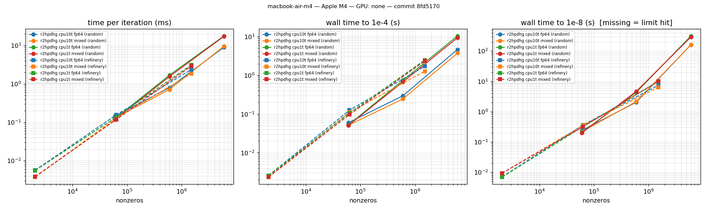

# Evidence pack

Generated by `bench/make_evidence.py` from **committed** CSVs in `bench/results/` only (CLAUDE.md §5.1). Every table names its source file; the git short hash is in each filename. Nothing here is a target or an estimate.

Files used:

- `bench/results/batch-T8760-macbook-air-m4-8fd5170.csv` (committed 2026-09-25)
- `bench/results/batch-T8760-macbook-air-m4-ea97521.csv` (committed 2026-09-25)
- `bench/results/batch-macbook-air-m4-8fd5170.csv` (committed 2026-09-25)
- `bench/results/batch-macbook-air-m4-ea97521.csv` (committed 2026-09-25)
- `bench/results/miplib3-macbook-air-m4-0935157.csv` (committed 2026-09-25)
- `bench/results/netlib-full-r2hpdhg-fp64-gm12-macbook-air-m4-4f0db8c.csv` (committed 2026-09-25)
- `bench/results/netlib-full-r2hpdhg-fp64-gm4-macbook-air-m4-4f0db8c-dirty.csv` (committed 2026-09-25)
- `bench/results/netlib-full-r2hpdhg-fp64-macbook-air-m4-01f2eec.csv` (committed 2026-09-25)
- `bench/results/netlib-full-r2hpdhg-fp64-macbook-air-m4-4f0fc82.csv` (committed 2026-09-25)
- `bench/results/netlib-full-r2hpdhg-fp64-macbook-air-m4-5649634.csv` (committed 2026-09-25)
- `bench/results/netlib-full-r2hpdhg-fp64-macbook-air-m4-83736ba.csv` (committed 2026-09-25)
- `bench/results/netlib-full-r2hpdhg-fp64-macbook-air-m4-8fd5170.csv` (committed 2026-09-25)
- `bench/results/netlib-full-r2hpdhg-fp64-macbook-air-m4-f10527c.csv` (committed 2026-09-25)
- `bench/results/netlib-full-r2hpdhg-fp64-presolve-macbook-air-m4-01f2eec.csv` (committed 2026-09-25)
- `bench/results/netlib-full-r2hpdhg-fp64-presolve-macbook-air-m4-83736ba.csv` (committed 2026-09-25)
- `bench/results/netlib-small-3318a86.csv` (committed 2026-09-24)
- `bench/results/netlib-small-4f0fc82.csv` (committed 2026-09-25)
- `bench/results/netlib-small-62a13f2.csv` (committed 2026-09-24)
- `bench/results/netlib-small-8fd5170.csv` (committed 2026-09-25)
- `bench/results/netlib-small-f10527c.csv` (committed 2026-09-25)
- `bench/results/scale-macbook-air-m4-62a13f2.csv` (committed 2026-09-24)
- `bench/results/scale-macbook-air-m4-8fd5170.csv` (committed 2026-09-25)
- `bench/results/scale-macbook-air-m4-ea97521.csv` (committed 2026-09-25)
- `bench/results/scale-macbook-air-m4-f10527c.csv` (committed 2026-09-25)
- `bench/results/warm-start-macbook-air-m4-8fd5170.csv` (committed 2026-09-25)
- `bench/results/warm-start-macbook-air-m4-bd4e174.csv` (committed 2026-09-25)
- `bench/results/warm-start-macbook-air-m4-d699097.csv` (committed 2026-09-25)
- `bench/results/warm-start-macbook-air-m4-ea97521.csv` (committed 2026-09-25)

## 1. Correctness on small Netlib (oracle, PDLP-style PDHG, r²HPDHG; fp64 and mixed)

Source: `bench/results/netlib-small-8fd5170.csv` — machine `macbook-air-m4` (Apple M4), commit `8fd5170`.

| instance | rows×cols | published optimum | oracle dd | pdlp fp64 | pdlp mixed | r2hpdhg fp64 | r2hpdhg mixed |
|---|---|---|---|---|---|---|---|
| afiro | 27×32 | -464.75314286 | -464.753142857 (PASS) | -464.753143836 (PASS, 512 it) | -464.75314366 (PASS, 512 it) | -464.753141878 (PASS, 448 it) | -464.753142804 (PASS, 512 it) |
| sc50a | 50×48 | -64.575077059 | -64.5750770586 (PASS) | -64.575077139 (PASS, 1664 it) | -64.5750772447 (PASS, 1856 it) | -64.5750775154 (PASS, 768 it) | -64.5750776003 (PASS, 832 it) |
| sc50b | 50×48 | -70 | -70 (PASS) | -69.9999991375 (PASS, 1984 it) | -69.9999990393 (PASS, 1664 it) | -69.9999990368 (PASS, 1792 it) | -70.0000004428 (PASS, 1856 it) |
| kb2 | 43×41 | -1749.9001299 | -1749.90012991 (PASS) | -1749.90012991 (PASS, 39872 it) | -1749.90012991 (PASS, 46272 it) | -1749.90012991 (PASS, 21568 it) | -1749.90012991 (PASS, 21568 it) |
| adlittle | 56×97 | 225494.96316 | 225494.963162 (PASS) | 225494.964192 (PASS, 3968 it) | 225494.964193 (PASS, 3968 it) | 225494.964997 (PASS, 2560 it) | 225494.964432 (PASS, 3584 it) |
| blend | 74×83 | -30.812149846 | -30.8121498458 (PASS) | -30.8121498833 (PASS, 4992 it) | -30.8121498294 (PASS, 4992 it) | -30.8121496993 (PASS, 1920 it) | -30.8121497656 (PASS, 2560 it) |
| share2b | 96×79 | -415.73224074 | -415.732240741 (PASS) | -415.732245251 (PASS, 99904 it) | -415.732231603 (PASS, 102848 it) | -415.732233047 (PASS, 49344 it) | -415.732237459 (PASS, 65536 it) |
| sc105 | 105×103 | -52.202061212 | -52.2020612117 (PASS) | -52.2020604186 (PASS, 4608 it) | -52.2020606572 (PASS, 4992 it) | -52.2020611773 (PASS, 2304 it) | -52.2020607122 (PASS, 3456 it) |
| stocfor1 | 117×111 | -41131.976219 | -41131.9762194 (PASS) | -41131.9757971 (PASS, 12928 it) | -41131.9757367 (PASS, 10944 it) | -41131.976296 (PASS, 6016 it) | -41131.9767007 (PASS, 6912 it) |
| recipe | 91×180 | -266.616 | -266.616 (PASS) | -266.616000003 (PASS, 1664 it) | -266.616000014 (PASS, 3776 it) | -266.616000004 (PASS, 1024 it) | -266.615999984 (PASS, 1536 it) |

**50 of 50 runs verified PASS** by `tools/verify.py` (independent reader, primal/dual/gap ≤ 1e-6 relative) and within 1e-6 of the published optimum. First-order runs target relative KKT 1e-8.

Iterations to 1e-8 (fp64): r²HPDHG needs fewer than PDLP-style PDHG on 10 of 10 instances; total 87744 vs 172096 iterations.

## 1b. Full Netlib LP set (first-order engine)

Source: `bench/results/netlib-full-r2hpdhg-fp64-macbook-air-m4-8fd5170.csv` — r2hpdhg fp64 on cpu (`macbook-air-m4`, Apple M4), commit `8fd5170`, time limit 60.0 s per model.

- **85 of 93** Netlib LPs solved to relative KKT 1e-8 and verified PASS by `tools/verify.py`; **85** of those agree with HiGHS to 1e-6 relative.
- 8 hit the time/iteration limit (listed below, not hidden); 0 other outcomes.
- Certified (rounding-proof, Neumaier–Shcherbina) bound from the returned duals: finite for **40 of 85** solved models; worst certified gap |obj − bound|/(1+|obj|) = 1.7e-06. Infinite where a dual points at an infinite bound (reported, not faked).

| model | rows | cols | nnz | status | iterations | rel. err vs HiGHS at stop |
|---|---|---|---|---|---|---|
| d2q06c | 2171 | 5167 | 32417 | TimeLimit | 1707392 | 2.64e-06 |
| fit2d | 25 | 10500 | 129018 | TimeLimit | 340480 | 1.58e-05 |
| greenbea | 2392 | 5405 | 30877 | TimeLimit | 1797504 | 6.05e-03 |
| greenbeb | 2392 | 5405 | 30877 | TimeLimit | 1811008 | 2.96e-05 |
| pilot.ja | 940 | 1988 | 14698 | TimeLimit | 4663488 | 1.04e-12 |
| pilot | 1441 | 3652 | 43167 | TimeLimit | 1426240 | 8.22e-05 |
| pilot.we | 722 | 2789 | 9126 | TimeLimit | 5419968 | 1.34e-10 |
| pilot87 | 2030 | 4883 | 73152 | TimeLimit | 799296 | 6.07e-06 |

### 1c. Ablations (full Netlib, 60 s per model)

| CSV | settings | solved + verified |
|---|---|---|
| `netlib-full-r2hpdhg-fp64-gm12-macbook-air-m4-4f0db8c.csv` | geometric_mean_iterations=12 | 85/93 |
| `netlib-full-r2hpdhg-fp64-gm4-macbook-air-m4-4f0db8c-dirty.csv` | geometric_mean_iterations=4 | 84/93 |
| `netlib-full-r2hpdhg-fp64-presolve-macbook-air-m4-01f2eec.csv` | presolve | 85/93 |
| `netlib-full-r2hpdhg-fp64-presolve-macbook-air-m4-83736ba.csv` | presolve | 85/93 |
| `netlib-full-r2hpdhg-fp64-macbook-air-m4-01f2eec.csv` | default of that commit | 83/93 |
| `netlib-full-r2hpdhg-fp64-macbook-air-m4-83736ba.csv` | default of that commit | 83/93 |
| `netlib-full-r2hpdhg-fp64-macbook-air-m4-f10527c.csv` | default of that commit | 81/93 |

Decisions: geometric-mean scaling is adaptive (docs/DECISIONS.md #17); presolve see #22.

## 2. Scaling on generated LPs with known optimum (CPU)

Source: `bench/results/scale-macbook-air-m4-8fd5170.csv` — machine `macbook-air-m4` (Apple M4; GPU: none), commit `8fd5170`.

| instance | rows | nnz | engine | backend | threads | prec | status | iterations | s to 1e-4 | s to 1e-8 | ms/iter | rel. err vs known opt | verify |
|---|---|---|---|---|---|---|---|---|---|---|---|---|---|
| rand-10000-s1 | 10000 | 60024 | r2hpdhg | cpu | 1 | fp64 | Optimal | 1536 | 0.0519 | 0.207 | 0.123 | 6.34e-10 | PASS |
| rand-10000-s1 | 10000 | 60024 | r2hpdhg | cpu | 1 | mixed | Optimal | 1536 | 0.0505 | 0.198 | 0.117 | 1.84e-10 | PASS |
| rand-10000-s1 | 10000 | 60024 | r2hpdhg | cpu | 10 | fp64 | Optimal | 1536 | 0.0597 | 0.24 | 0.143 | 6.34e-10 | PASS |
| rand-10000-s1 | 10000 | 60024 | r2hpdhg | cpu | 10 | mixed | Optimal | 1536 | 0.0514 | 0.218 | 0.13 | 1.84e-10 | PASS |
| rand-100000-s1 | 100000 | 600228 | r2hpdhg | cpu | 1 | fp64 | Optimal | 2496 | 0.746 | 4.37 | 1.7 | 2.44e-10 | PASS |
| rand-100000-s1 | 100000 | 600228 | r2hpdhg | cpu | 1 | mixed | Optimal | 2944 | 0.676 | 4.73 | 1.56 | 5.14e-11 | PASS |
| rand-100000-s1 | 100000 | 600228 | r2hpdhg | cpu | 10 | fp64 | Optimal | 2496 | 0.296 | 2.07 | 0.8 | 2.44e-10 | PASS |
| rand-100000-s1 | 100000 | 600228 | r2hpdhg | cpu | 10 | mixed | Optimal | 2944 | 0.245 | 2.17 | 0.714 | 5.14e-11 | PASS |
| rand-1000000-s1 | 1000000 | 6002453 | r2hpdhg | cpu | 1 | fp64 | Optimal | 17600 | 10.5 | 317 | 17.9 | 1.42e-11 | skipped |
| rand-1000000-s1 | 1000000 | 6002453 | r2hpdhg | cpu | 1 | mixed | Optimal | 16576 | 9.4 | 292 | 17.4 | 1.23e-11 | skipped |
| rand-1000000-s1 | 1000000 | 6002453 | r2hpdhg | cpu | 10 | fp64 | Optimal | 17600 | 4.67 | 161 | 9.09 | 1.42e-11 | skipped |
| rand-1000000-s1 | 1000000 | 6002453 | r2hpdhg | cpu | 10 | mixed | Optimal | 16576 | 3.75 | 161 | 9.65 | 1.23e-11 | skipped |
| refinery-T12-s1 | 588 | 2065 | r2hpdhg | cpu | 1 | fp64 | Optimal | 1088 | 0.00253 | 0.0069 | 0.0055 | 3.20e-11 | PASS |
| refinery-T12-s1 | 588 | 2065 | r2hpdhg | cpu | 1 | mixed | Optimal | 2240 | 0.00234 | 0.0093 | 0.0038 | 3.83e-10 | PASS |
| refinery-T12-s1 | 588 | 2065 | r2hpdhg | cpu | 10 | fp64 | Optimal | 1088 | 0.00258 | 0.007 | 0.0056 | 3.20e-11 | PASS |
| refinery-T12-s1 | 588 | 2065 | r2hpdhg | cpu | 10 | mixed | Optimal | 2240 | 0.00233 | 0.0093 | 0.0037 | 3.83e-10 | PASS |
| refinery-T365-s1 | 17885 | 63134 | r2hpdhg | cpu | 1 | fp64 | Optimal | 1984 | 0.106 | 0.32 | 0.135 | 8.22e-12 | PASS |
| refinery-T365-s1 | 17885 | 63134 | r2hpdhg | cpu | 1 | mixed | Optimal | 2304 | 0.0972 | 0.322 | 0.117 | 3.18e-12 | PASS |
| refinery-T365-s1 | 17885 | 63134 | r2hpdhg | cpu | 10 | fp64 | Optimal | 1984 | 0.126 | 0.365 | 0.155 | 8.22e-12 | PASS |
| refinery-T365-s1 | 17885 | 63134 | r2hpdhg | cpu | 10 | mixed | Optimal | 2304 | 0.112 | 0.354 | 0.128 | 3.18e-12 | PASS |
| refinery-T8760-s1 | 429240 | 1515469 | r2hpdhg | cpu | 1 | fp64 | Optimal | 2880 | 2.49 | 9.95 | 3.15 | 1.49e-13 | PASS |
| refinery-T8760-s1 | 429240 | 1515469 | r2hpdhg | cpu | 1 | mixed | Optimal | 3136 | 2.36 | 10.1 | 2.94 | 1.20e-13 | PASS |
| refinery-T8760-s1 | 429240 | 1515469 | r2hpdhg | cpu | 10 | fp64 | Optimal | 2880 | 1.72 | 7.49 | 2.38 | 1.49e-13 | PASS |
| refinery-T8760-s1 | 429240 | 1515469 | r2hpdhg | cpu | 10 | mixed | Optimal | 3136 | 1.28 | 6.45 | 1.85 | 1.20e-13 | PASS |

### 2b. Reference: HiGHS on the same instances

Source: `bench/results/scale-macbook-air-m4-62a13f2.csv` (same run, same machine). HiGHS default algorithm, separate process, hard-killed at the cap. HiGHS returns a vertex solution at simplex accuracy; our column is time to relative KKT 1e-8 with verifier-grade feasibility — not the identical accuracy target.

| instance | rows | nnz | r²HPDHG fp64 s→1e-8 | HiGHS s |
|---|---|---|---|---|
| rand-10000-s1 | 10000 | 60024 | 0.192 | 46.4 |
| rand-100000-s1 | 100000 | 600228 | 6.78 | > 600 (TimeLimit) |
| rand-1000000-s1 | 1000000 | 6002453 | 294 | > 600 (TimeLimit) |
| refinery-T12-s1 | 588 | 2065 | 0.0041 | 0.0073 |
| refinery-T365-s1 | 17885 | 63134 | 0.2 | 3.38 |
| refinery-T8760-s1 | 429240 | 1515469 | 7.38 | > 630 (TimeLimit) |

## 3. CPU vs GPU

**Not measured yet.** The CUDA backend (`src/gpu/cuda_backend.cu`) is written and type-checked on macOS, but no committed CSV comes from a GPU machine, so this pack makes **no GPU speed claim**. To produce one: `PS26119_MACHINE=<name> scripts/gpu_check.sh` on the NVIDIA laptop / university server, then commit `bench/results/` and rerun this script.

## 4. Refinery planning year

Hourly year, T = 8760 periods: 429240 rows, 516840 columns, 1515469 nonzeros (generated by `bench/generate_refinery_lp.py`; optimum known by construction).

| engine | backend | threads | prec | status | iterations | s to 1e-4 | s to 1e-8 | rel. err vs known opt | verify | source |
|---|---|---|---|---|---|---|---|---|---|---|
| highs | cpu | 1 | fp64 | TimeLimit | – | – | – | – | reference | `scale-macbook-air-m4-62a13f2.csv` |
| r2hpdhg | cpu | 1 | fp64 | Optimal | 2880 | 2.49 | 9.95 | 1.49e-13 | PASS | `scale-macbook-air-m4-8fd5170.csv` |
| r2hpdhg | cpu | 1 | mixed | Optimal | 3136 | 2.36 | 10.1 | 1.20e-13 | PASS | `scale-macbook-air-m4-8fd5170.csv` |
| r2hpdhg | cpu | 10 | fp64 | Optimal | 2880 | 1.72 | 7.49 | 1.49e-13 | PASS | `scale-macbook-air-m4-8fd5170.csv` |
| r2hpdhg | cpu | 10 | mixed | Optimal | 3136 | 1.28 | 6.45 | 1.20e-13 | PASS | `scale-macbook-air-m4-8fd5170.csv` |

## 4b. Warm-started re-solves (what-if scenarios on the refinery LP)

Source: `bench/results/warm-start-macbook-air-m4-8fd5170.csv` — `macbook-air-m4` (Apple M4), commit `8fd5170`. Each scenario solved cold and warm-started from the base-case solution, both to 1e-8, both verified.

| instance | scenario | objective change | cold it | warm it | warm/cold | warm+ω it | warm+ω/cold | verify |
|---|---|---|---|---|---|---|---|---|
| refinery-T365-s1 | price | +3.180e-03 | 13824 | 11648 | 0.843 | 16512 | 1.194 | PASS/PASS/PASS |
| refinery-T365-s1 | demand | +3.068e-02 | 1792 | 1984 | 1.107 | 2240 | 1.250 | PASS/PASS/PASS |
| refinery-T365-s1 | crude | -1.124e-02 | 2304 | 1344 | 0.583 | 1344 | 0.583 | PASS/PASS/PASS |
| refinery-T8760-s1 | price | +3.596e-03 | 224320 (TimeLimit) | 46976 | 0.209 | 34368 | 0.153 | FAIL/PASS/PASS |
| refinery-T8760-s1 | demand | +2.946e-02 | 3264 | 1600 | 0.490 | 2240 | 0.686 | PASS/PASS/PASS |
| refinery-T8760-s1 | crude | -9.681e-03 | 3072 | 1408 | 0.458 | 1472 | 0.479 | PASS/PASS/PASS |

warm = start from the base solution's (x, y) (default); warm+ω = also reuse its primal weight (opt-in `--warm-weight`). Iteration counts are deterministic; wall times are in the CSV.
Source: `bench/results/warm-start-macbook-air-m4-bd4e174.csv` — `macbook-air-m4` (Apple M4), commit `bd4e174`. Each scenario solved cold and warm-started from the base-case solution, both to 1e-8, both verified.

| instance | scenario | objective change | cold it | warm it | warm/cold | warm+ω it | warm+ω/cold | verify |
|---|---|---|---|---|---|---|---|---|
| refinery-T365-s1 | price | +3.180e-03 | 11328 | 15232 | 1.345 | 41472 | 3.661 | PASS/PASS/PASS |
| refinery-T365-s1 | demand | +3.068e-02 | 1856 | 1984 | 1.069 | 1408 | 0.759 | PASS/PASS/PASS |
| refinery-T365-s1 | crude | -1.124e-02 | 1664 | 1280 | 0.769 | 1280 | 0.769 | PASS/PASS/PASS |
| refinery-T8760-s1 | price | +3.596e-03 | 94848 | 57792 | 0.609 | 53632 | 0.565 | PASS/PASS/PASS |
| refinery-T8760-s1 | demand | +2.946e-02 | 3136 | 1984 | 0.633 | 1792 | 0.571 | PASS/PASS/PASS |
| refinery-T8760-s1 | crude | -9.681e-03 | 2816 | 1792 | 0.636 | 1600 | 0.568 | PASS/PASS/PASS |

warm = start from the base solution's (x, y) (default); warm+ω = also reuse its primal weight (opt-in `--warm-weight`). Iteration counts are deterministic; wall times are in the CSV.
Source: `bench/results/warm-start-macbook-air-m4-d699097.csv` — `macbook-air-m4` (Apple M4), commit `d699097`. Each scenario solved cold and warm-started from the base-case solution, both to 1e-8, both verified.

| instance | scenario | objective change | cold it | warm it | warm/cold | warm+ω it | warm+ω/cold | verify |
|---|---|---|---|---|---|---|---|---|
| refinery-T365-s1 | price | +3.180e-03 | 13504 | 13760 | 1.019 | 28544 | 2.114 | PASS/PASS/PASS |
| refinery-T365-s1 | demand | +3.068e-02 | 2240 | 1984 | 0.886 | 1408 | 0.629 | PASS/PASS/PASS |
| refinery-T365-s1 | crude | -1.124e-02 | 1664 | 1408 | 0.846 | 1408 | 0.846 | PASS/PASS/PASS |
| refinery-T8760-s1 | price | +3.596e-03 | 73536 | 55232 | 0.751 | 34688 | 0.472 | PASS/PASS/PASS |
| refinery-T8760-s1 | demand | +2.946e-02 | 2944 | 2048 | 0.696 | 1856 | 0.630 | PASS/PASS/PASS |
| refinery-T8760-s1 | crude | -9.681e-03 | 2880 | 1792 | 0.622 | 1408 | 0.489 | PASS/PASS/PASS |

warm = start from the base solution's (x, y) (default); warm+ω = also reuse its primal weight (opt-in `--warm-weight`). Iteration counts are deterministic; wall times are in the CSV.
Source: `bench/results/warm-start-macbook-air-m4-ea97521.csv` — `macbook-air-m4` (Apple M4), commit `ea97521`. Each scenario solved cold and warm-started from the base-case solution, both to 1e-8, both verified.

| instance | scenario | objective change | cold it | warm it | warm/cold | warm+ω it | warm+ω/cold | verify |
|---|---|---|---|---|---|---|---|---|
| refinery-T365-s1 | price | +3.180e-03 | 11328 | 15232 | 1.345 | 41472 | 3.661 | PASS/PASS/PASS |
| refinery-T365-s1 | demand | +3.068e-02 | 1856 | 1984 | 1.069 | 1408 | 0.759 | PASS/PASS/PASS |
| refinery-T365-s1 | crude | -1.124e-02 | 1664 | 1280 | 0.769 | 1280 | 0.769 | PASS/PASS/PASS |
| refinery-T8760-s1 | price | +3.596e-03 | 94592 | 57792 | 0.611 | 53632 | 0.567 | PASS/PASS/PASS |
| refinery-T8760-s1 | demand | +2.946e-02 | 3136 | 1984 | 0.633 | 1792 | 0.571 | PASS/PASS/PASS |
| refinery-T8760-s1 | crude | -9.681e-03 | 2816 | 1792 | 0.636 | 1600 | 0.568 | PASS/PASS/PASS |

warm = start from the base solution's (x, y) (default); warm+ω = also reuse its primal weight (opt-in `--warm-weight`). Iteration counts are deterministic; wall times are in the CSV.

## 4c. Batched scenarios (many LPs sharing one matrix)

Source: `bench/results/batch-T8760-macbook-air-m4-8fd5170.csv`, `bench/results/batch-macbook-air-m4-8fd5170.csv` — `macbook-air-m4` (Apple M4), commit `8fd5170`. K price scenarios of the refinery LP: K separate solves vs one batched solve (one SpMM per iteration). Every batch answer verified and compared with its separate solve.

| instance | K | separate solves s | batch s | speed-up | all optimal | all verified | max objective disagreement |
|---|---|---|---|---|---|---|---|
| refinery-T8760-s1 | 4 | 1.44e+03 | 2.12e+03 | 0.68 | True | True | 3.4e-11 |
| refinery-T365-s1 | 4 | 11.2 | 10.1 | 1.11 | True | True | 1.4e-13 |
| refinery-T365-s1 | 8 | 21.7 | 19.5 | 1.11 | True | True | 1.4e-13 |
| refinery-T365-s1 | 16 | 46.8 | 40.9 | 1.15 | True | True | 1.4e-13 |

## 4d. MILP prototype (branch-and-bound, small MIPLIB 3)

Source: `bench/results/miplib3-macbook-air-m4-0935157.csv` — `macbook-air-m4`, commit `0935157`. Prototype: dense double-double simplex as node solver, depth-first then best-bound, most-fractional branching, no cuts. **10 of 14** solved to proven optimality within the limit, each verified (feasibility + integrality) and equal to the HiGHS optimum.

| instance | rows | cols | int | status | objective | HiGHS | gap | s | verify |
|---|---|---|---|---|---|---|---|---|---|
| p0033 | 16 | 33 | 33 | Optimal | 3089 | 3088.9999999999995 | 0 | 0.192 | PASS |
| flugpl | 18 | 18 | 11 | Optimal | 1201500 | 1201500.0 | 0 | 0.317 | PASS |
| egout | 98 | 141 | 55 | Optimal | 568.10070000000007 | 568.1007000000001 | 0 | 4.68 | PASS |
| enigma | 21 | 100 | 100 | Optimal | 0 | 0.0 | 0 | 3.21 | PASS |
| lseu | 28 | 89 | 89 | Optimal | 1120 | 1120.0 | 0 | 18.4 | PASS |
| mod008 | 6 | 319 | 319 | Optimal | 307 | 306.99999999996334 | 0 | 3.82 | PASS |
| stein27 | 118 | 27 | 27 | Optimal | 18 | 17.99999999999989 | 0 | 16.2 | PASS |
| pk1 | 45 | 86 | 55 | TimeLimit | 32 | 11.000000000000178 | 0.761372 | 300 | — |
| gt2 | 29 | 188 | 188 | TimeLimit | 122524 | 21166.0 | 0.886078 | 300 | — |
| rgn | 24 | 180 | 100 | Optimal | 82.199999239999983 | 82.19999923999372 | 0 | 2.47 | PASS |
| bell5 | 91 | 104 | 58 | TimeLimit | nan | 8966413.70538 | nan | 300 | — |
| bell3a | 123 | 133 | 71 | TimeLimit | 917454.46036000026 | 878430.3159999951 | 0.0450104 | 300 | — |
| misc03 | 96 | 160 | 159 | Optimal | 3360 | 3359.9999999999295 | 0 | 65 | PASS |
| p0201 | 133 | 201 | 201 | Optimal | 7615 | 7615.000000000004 | 0 | 270 | PASS |

## 5. What we do NOT do yet (honest list)

- **No GPU number is claimed** unless a GPU CSV appears in §3. The CUDA backend has not yet been compiled by nvcc or run at the time this list was written.
- **No MPS reader of our own in this build** — it is owned by a teammate; until it lands, MPS files are converted with `tools/mps_to_lpm.py` (highspy, tooling only, never linked).
- **No sparse simplex and no crossover** yet: first-order solutions are accurate to the stated tolerance but are not vertices; exact duals/ranging need the (planned) crossover. Presolve is basic (empty rows, fixed/empty columns, singleton rows) — no doubleton/dominated-column reductions.
- **Infeasibility / unboundedness detection in the first-order engines is new and only lightly tested** (ray certificates, checked in fp64 on the original problem; unit-tested on hand-made infeasible/unbounded LPs, not yet on the Netlib infeasible set).
- **MILP is a prototype** (§4d): branch-and-bound over a dense double-double simplex, no cuts, no warm-started node LPs — correct on small models only. **No QP** yet.
- **Generated instances**: the refinery LP has refinery structure, but its prices and inequality right-hand sides come from the KKT construction (synthetic), not from plant data; random LPs of this kind are friendly to first-order methods. Netlib / Mittelmann large models are the next evidence step.
- Batched scenarios (§4c) run on the CPU only (no GPU SpMM kernel yet) and without infeasibility detection; certified bounds are −∞ whenever a dual multiplier points at an infinite bound (no bound tightening yet to repair this).
- Laptop timings vary run to run (a fanless MacBook Air throttles and macOS moves threads between performance and efficiency cores): the same 1e6-row run has taken 294 s and 539 s for identical iteration counts. Iteration counts are deterministic; compare those first.
- CPU runs are single-threaded (deterministic by default; OpenMP is optional and off).
